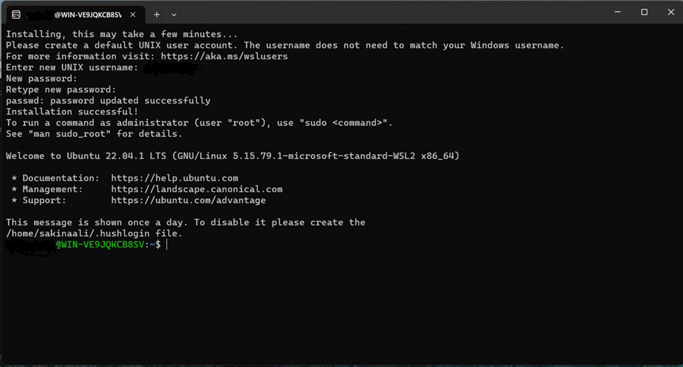

<!--ts-->
* [Overview](#overview)
* [Azure Pre-requisites](#azure-pre-requisites)
   * [Special circumstances](#special-circumstances)
* [Configure the toolchain](#configure-the-toolchain)
   * [From a local machine](#from-a-local-machine)
      * [Clone the repo](#clone-the-repo)
      * [Set up the toolchain on Ubuntu 20.04 (e.g. WSL2)](#set-up-the-toolchain-on-ubuntu-2004-eg-wsl2)
   * [From a deployer VM](#from-a-deployer-vm)
   * [Create a deployer VM](#create-a-deployer-vm)
      * [Clone the repo](#clone-the-repo-1)
      * [Set up the toolchain](#set-up-the-toolchain)
* [Plan your networking IP range](#plan-your-networking-ip-range)
   * [59 nodes system =&gt; 10.0.0.0/25](#59-nodes-system--1000025)
   * [123 nodes system =&gt; 10.0.0.0/24](#123-nodes-system--1000024)
   * [251 nodes system =&gt; 10.0.0.0/23](#251-nodes-system--1000023)
   * [507 nodes system =&gt; 10.0.0.0/22](#507-nodes-system--1000022)
   * [1019 nodes system =&gt; 10.0.0.0/21](#1019-nodes-system--1000021)
   * [2043 nodes system =&gt; 10.0.0.0/20](#2043-nodes-system--1000020)
   * [4091 nodes system =&gt; 10.0.0.0/19](#4091-nodes-system--1000019)
   * [8187 nodes system =&gt; 10.0.0.0/19](#8187-nodes-system--1000019)
* [Define the environment](#define-the-environment)
* [Deploy your environment](#deploy-your-environment)
   * [Azure infrastructure](#azure-infrastructure)
      * [Login with a user account](#login-with-a-user-account)
      * [Login with a Managed Identity](#login-with-a-managed-identity)
      * [Login with a Service Principal Name](#login-with-a-service-principal-name)
      * [Build the Azure infrastructure](#build-the-azure-infrastructure)
   * [Create users passwords for all users defined in the config.yml file](#create-users-passwords-for-all-users-defined-in-the-configyml-file)
* [Installation](#installation)
   * [Install and configure the deployed environment](#install-and-configure-the-deployed-environment)
* [Add Users](#add-users)
   * [Add users in the configuration file](#add-users-in-the-configuration-file)
   * [Create users passwords](#create-users-passwords)
   * [Add users to the system](#add-users-to-the-system)
* [Build Images](#build-images)
   * [Pre-requisites](#pre-requisites)
   * [Image definition in the configuration file](#image-definition-in-the-configuration-file)
   * [Build an image](#build-an-image)
   * [Update the Cycle cluster template](#update-the-cycle-cluster-template)
   * [Adding new packages in a custom image](#adding-new-packages-in-a-custom-image)
* [Administrator Access](#administrator-access)
   * [SSHing Linux VMs](#sshing-linux-vms)
   * [Accessing the CycleCloud portal](#accessing-the-cyclecloud-portal)
      * [Accessing the AD VM](#accessing-the-ad-vm)
* [How To](#how-to)
   * [How to use an existing VNET ?](#how-to-use-an-existing-vnet-)
      * [Pre-requisities for using an existing VNET](#pre-requisities-for-using-an-existing-vnet)
      * [Creating a standalone VNET for AZ-HOP](#creating-a-standalone-vnet-for-az-hop)
   * [How to use DNS forwarders ?](#how-to-use-dns-forwarders-)
   * [How to deploy ANF with Dual protocol](#how-to-deploy-anf-with-dual-protocol)
   * [Deploy in a locked down network environment](#deploy-in-a-locked-down-network-environment)
      * [Allow traffic to list of external domains](#allow-traffic-to-list-of-external-domains)
   * [Disable Public IP scenario](#disable-public-ip-scenario)
   * [Use your own SSL certificate](#use-your-own-ssl-certificate)
   * [Not deploy ANF](#not-deploy-anf)
   * [Use an existing NFS mount point](#use-an-existing-nfs-mount-point)
   * [Use Azure Active Directory for MFA](#use-azure-active-directory-for-mfa)
   * [Use an existing Azure Database for MariaDB server](#use-an-existing-azure-database-for-mariadb-server)
   * [Use an existing Active Directory](#use-an-existing-active-directory)
      * [Network pre-requisites](#network-pre-requisites)
      * [Domain pre-requisites](#domain-pre-requisites)
      * [azhop configuration file](#azhop-configuration-file)
      * [Deploy and configure your environemnt](#deploy-and-configure-your-environemnt)
* [Terraform and Bicep coverage table](#terraform-and-bicep-coverage-table)
* [Helper Scripts](#helper-scripts)
   * [ansible_prereqs.sh](#ansible_prereqssh)
   * [azhop_states.sh](#azhop_statessh)
   * [build.sh](#buildsh)
   * [create_passwords.sh](#create_passwordssh)
   * [install.sh](#installsh)
   * [packer/build_image.sh](#packerbuild_imagesh)
   * [bin/connect](#binconnect)
   * [bin/get_secret](#binget_secret)
* [Telemetry](#telemetry)
<!--te-->
<!-- https://github.com/ekalinin/github-markdown-toc -->
<!-- gh-md-toc --insert --no-backup --hide-footer docs/deploy/index.md -->

# Overview


Once the [prerequisites](#azure-pre-requisites) are in place, deploying a greenfield `azhop` environment involves essentially these steps:

 1. Clone the repo: `git clone --recursive https://github.com/Azure/az-hop.git -b <version>` 
 1. Copy the `examples/minimum_public_ip.yml` template file to `config.yml` and update it with your settings
 1. Build the infrastructure on azure: `./build.sh -a apply`
 1. Create user passwords: `./create_passwords.sh` 
 1. Install the software components on the provisioned infrastructure: `./install.sh` 

Once deployed, you can connect to the OnDemand web portal via:

 - URL: get from `grep ondemand_fqdn playbooks/group_vars/all.yml` 
 - username: `clusteradmin` 
 - password: get from `./bin/get_secret clusteradmin`

 The following sections provide detailed instructions for each of these steps.


# Azure Pre-requisites

- When using a user account
  - you need to be **Owner** of the subscription
- When using a Service Principal Name, the service principal needs to be
  - **"Contributor"** on the subscription
  - **"User Access Administrator"** on the subscription
- When using a managed Identity on a deployer VM it needs to be a **System/User Managed Identity** with
  - **"Contributor"** on the resource group
  - **"User Access Administrator"** on the subscription
  - **"Reader"** on the subscription
- Your subscription need to be registered for NetApp resource provider as explained [here](https://docs.microsoft.com/en-us/azure/azure-netapp-files/azure-netapp-files-register#waitlist)
- If using ANF Dual Protocol be aware of the limitation of one ANF account allow to be domain joined per region in the same subscription
- If deploying a Lustre Cluster, the Azure HPC Lustre marketplace image terms need to be accepted
```bash
az vm image terms accept --offer azurehpc-lustre --publisher azhpc --plan azurehpc-lustre-2_12
```
- If AlmaLinux Marketplace image is used, the terms need to be accepted as well
```bash
az vm image terms accept --offer almalinux-hpc --publisher almalinux --plan 8_5-hpc-gen2
```

- When using the default configurations in order to build your environment, make sure you have enough quota for :
  - 10 cores of Standard BS Family
    - 5 x Standard_B2ms
  - 4 cores of Standard DSv5 Family
    - 1 x Standard_D4s_v5
  - 80 cores of Standard DDv4 Family when deploying a Lustre Cluster
    - 2 x Standard_D8d_v4
    - 2 x Standard_D32d_v4
- For the compute and visualization nodes, you can adjust the maximum quota in your configuration file but make sure you have quota for these instances too :
  - For Code Server :
    - 10 cores of Standard FSv2 Family
  - For Compute Nodes depending on your configuration and needs :
    - 220 cores Standard_HC44rs
    - and/or 600 cores of Standard HBrsv2 Family
    - and/or 600 cores of Standard HBv3 Family
  - For Remote Visualization
    - 24 cores of Standard NVs_v3 Family

## Special circumstances
- When deploying in a zero-trust environment that automatically blocks access to high-risk TCP/UDP ports (e.g. 22) from the internet, follow the [hub and spoke network architecture](https://docs.microsoft.com/en-us/azure/architecture/reference-architectures/hybrid-networking/hub-spoke?tabs=cli).
  - In the hub, create:
    - the VPN gateway and virtual network
    - virtual machines for self-hosted Github Action runners
  - Each `azhop` deployment will be a spoke.
    - See [define the environment](#define-the-environment) for how to automatically peer the virtual network of `azhop` with that of the hub, and for how to change the SSH port of the jumpbox.

# Configure the toolchain
The toolchain can be setup either locally or from a deployer VM. See below for instructions regarding the installation.

## From a local machine

The toolchain for deployment is built to be run only from Linux, and preferably Ubuntu 20.04+. So, if you are running a Windows desktop you should use WSL2 with an Ubuntu 20.04 environment. Run the following commands to install WSL2 (you will only need to do this once on your local device).

To install WSL2 in your Windows machine:

1.	Open PowerShell as administrator.

 

2.	Execute the following command to install WSL:

```bash
wsl --install
```

3.	After installation is complete, restart your computer.

4.	Once your computer turns back on, run WSL (search for it in your computuer's Start menu if it doesn't open automatically). The prompt is going to ask you to set up a username and password for your Ubuntu Linux Virtual machine.


 
5.	Now, open your Linux shell (i.e. Command Prompt). Validate that you are running version 2 of WSL.

```bash
wsl --status
```


 
6.	Obtain root access with:

```bash
sudo su
```
 Your WSL environment is now ready.

### Clone the repo
Next, we will clone the Github repo into your working directory to acquire the necessary scripts for deployment. It is important to clone the repo with its submodule. You can do this with one of the two options:

> Note : pick up the latest stable release from [https://github.com/Azure/az-hop/releases](https://github.com/Azure/az-hop/releases) and replace `<version>`

- Option 1
```bash
git clone --recursive https://github.com/Azure/az-hop.git -b <version>
```
 
- Option 2
```bash
git clone https://github.com/Azure/az-hop.git -b <version>
cd az-hop
git submodule init
git submodule update
```

### Set up the toolchain on Ubuntu 20.04 (e.g. WSL2)
For Terraform to work properly on  WSL2, on the C drive, make sure to have the "metadata mount" option enabled.
Afterwards, you can directly run the `install.sh`  script: 

```bash
./toolset/scripts/install.sh
```

> Note : On Ubuntu you may have to run `apt-get update`

## From a deployer VM
`az-hop` can be deployed directly from an Ubuntu 20.04 VM on Azure.

## Create a deployer VM
Create a deployer VM in its own isolated VNET and if required with an Azure Bastion. Once built, enable System/User Managed Identity and grant the following roles :
  - **"Contributor"** on the subscription
  - **"User Access Administrator"** on the subscription
  - **"Reader"** on the subscription

> Note: **Contributor** on the `Subscription` can be reduced to `Resource Group` on the specific Resource Group you will deploy in. This Resource Group must be created before granting this role.

### Clone the repo
Connect to the VM and clone the repo with its submodule. You can do this with one of these two options.

> Note : pick up the latest stable release from [https://github.com/Azure/az-hop/releases](https://github.com/Azure/az-hop/releases) and replace `<version>`

- Option 1
```bash
git clone --recursive https://github.com/Azure/az-hop.git -b <version>
```

- Option 2
```bash
git clone https://github.com/Azure/az-hop.git -b <version>
cd az-hop
git submodule init
git submodule update
```

### Set up the toolchain
Run the `install.sh` script:

```bash
./toolset/scripts/install.sh
```

> Note : On Ubuntu you may have to run `apt-get update`


# Plan your networking IP range
`Az-hop` needs several subnets to work, while some of these are optional like `Bastion` and the `Gateway` others are mandatory. When peering the az-hop vnet to others vnet or to your enterprise thru a VPN you have to plan accordingly your address range to avoid conflicts. Below are examples to help you defined these ranges based on how large you want to size your compute infrastructure.

> Note: Be aware that for each subnet, Azure will reserve 5 IP addresses for it's internal usage

## 59 nodes system => 10.0.0.0/25

| Subnet | CIDR |    IP Range       | Nb IPs | First IP | Usable IPs |
|--------|-----:|:-----------------:|-------:|---------:|-----------:|
| frontend | 10.0.0.0/**29** | 10.0.0.0 - 10.0.0.7 | 8 | 10.0.0.4 | 3 |
| ad | 10.0.0.8/**29** | 10.0.0.8 - 10.0.0.15 | 8 | 10.0.0.12 | 3 |
| admin | 10.0.0.16/**28** | 10.0.0.16 - 10.0.0.31 | 16 | 10.0.0.20 | 11 |
| netapp | 10.0.0.32/**28** | 10.0.0.32 - 10.0.0.47 | 16 | 10.0.0.36 | 11 |
| gateway | 10.0.0.48/**28** | 10.0.0.48 - 10.0.0.63 | 16 | 10.0.0.48 | 11 |
| compute | 10.0.0.64/**26** | 10.0.0.64 - 10.0.0.127 | 64 | 10.0.0.96 | 59 |

> Note: Bastion is not supported in this scenario because it requires a /26 subnet and there is not enough space for it in this configuration. In that case, consider using a larger range.

## 123 nodes system => 10.0.0.0/24

| Subnet | CIDR |    IP Range       | Nb IPs | First IP | Usable IPs |
|--------|-----:|:-----------------:|-------:|---------:|-----------:|
| frontend | 10.0.0.0/**29** | 10.0.0.0 - 10.0.0.7 | 8 | 10.0.0.4 | 3 |
| ad | 10.0.0.8/**29** | 10.0.0.8 - 10.0.0.15 | 8 | 10.0.0.12 | 3 |
| admin | 10.0.0.16/**28** | 10.0.0.16 - 10.0.0.31 | 16 | 10.0.0.20 | 11 |
| netapp | 10.0.0.32/**28** | 10.0.0.32 - 10.0.0.47 | 16 | 10.0.0.36 | 11 |
| gateway or outbounddns | 10.0.0.48/**28** | 10.0.0.48 - 10.0.0.63 | 16 | 10.0.0.48 | 11 |
| bastion | 10.0.0.64/**26** | 10.0.0.64 - 10.0.0.127 | 64 | 10.0.0.64 | 59 |
| compute | 10.0.0.128/**25** | 10.0.0.128 - 10.0.0.255 | 128 | 10.0.0.132 | 123 |

> Note : This configuration doesn't support altogether gateway, bastion and outbounddns, you have to choose which one you need to deploy or use a larger IP range

## 251 nodes system => 10.0.0.0/23

| Subnet | CIDR |    IP Range       | Nb IPs | First IP | Usable IPs |
|--------|-----:|:-----------------:|-------:|---------:|-----------:|
| frontend | 10.0.0.0/**29** | 10.0.0.0 - 10.0.0.7 | 8 | 10.0.0.4 | 3 |
| ad | 10.0.0.8/**29** | 10.0.0.8 - 10.0.0.15 | 8 | 10.0.0.12 | 3 |
| admin | 10.0.0.16/**28** | 10.0.0.16 - 10.0.0.31 | 16 | 10.0.0.20 | 11 |
| netapp | 10.0.0.32/**28** | 10.0.0.32 - 10.0.0.47 | 16 | 10.0.0.36 | 11 |
| outbounddns | 10.0.0.48/**28** | 10.0.0.48 - 10.0.0.63 | 16 | 10.0.0.48 | 11 |
| bastion | 10.0.0.64/**26** | 10.0.0.64 - 10.0.0.127 | 64 | 10.0.0.64 | 59 |
| gateway | 10.0.0.128/**27** | 10.0.0.128 - 10.0.0.159 | 32 | 10.0.0.48 | 27 |
| empty | | | | | |
| compute | 10.0.1.0/**24** | 10.0.1.0 - 10.0.1.255 | 256 | 10.0.1.0 | 251 |

## 507 nodes system => 10.0.0.0/22

| Subnet | CIDR |    IP Range       | Nb IPs | First IP | Usable IPs |
|--------|-----:|:-----------------:|-------:|---------:|-----------:|
| frontend | 10.0.0.0/**29** | 10.0.0.0 - 10.0.0.7 | 8 | 10.0.0.4 | 3 |
| ad | 10.0.0.8/**29** | 10.0.0.8 - 10.0.0.15 | 8 | 10.0.0.12 | 3 |
| admin | 10.0.0.16/**28** | 10.0.0.16 - 10.0.0.31 | 16 | 10.0.0.20 | 11 |
| netapp | 10.0.0.32/**28** | 10.0.0.32 - 10.0.0.47 | 16 | 10.0.0.36 | 11 |
| outbounddns | 10.0.0.48/**28** | 10.0.0.48 - 10.0.0.63 | 16 | 10.0.0.48 | 11 |
| bastion | 10.0.0.64/**26** | 10.0.0.64 - 10.0.0.127 | 64 | 10.0.0.64 | 59 |
| gateway | 10.0.0.128/**27** | 10.0.0.128 - 10.0.0.159 | 32 | 10.0.0.48 | 27 |
| empty | | | | | |
| compute | 10.0.2.0/**23** | 10.0.2.0 - 10.0.3.255 | 512 | 10.0.2.0 | 507 |

## 1019 nodes system => 10.0.0.0/21

| Subnet | CIDR |    IP Range       | Nb IPs | First IP | Usable IPs |
|--------|-----:|:-----------------:|-------:|---------:|-----------:|
| frontend | 10.0.0.0/**29** | 10.0.0.0 - 10.0.0.7 | 8 | 10.0.0.4 | 3 |
| ad | 10.0.0.8/**29** | 10.0.0.8 - 10.0.0.15 | 8 | 10.0.0.12 | 3 |
| admin | 10.0.0.16/**28** | 10.0.0.16 - 10.0.0.31 | 16 | 10.0.0.20 | 11 |
| netapp | 10.0.0.32/**28** | 10.0.0.32 - 10.0.0.47 | 16 | 10.0.0.36 | 11 |
| outbounddns | 10.0.0.48/**28** | 10.0.0.48 - 10.0.0.63 | 16 | 10.0.0.48 | 11 |
| bastion | 10.0.0.64/**26** | 10.0.0.64 - 10.0.0.127 | 64 | 10.0.0.64 | 59 |
| gateway | 10.0.0.128/**27** | 10.0.0.128 - 10.0.0.159 | 32 | 10.0.0.48 | 27 |
| empty | | | | | |
| compute | 10.0.4.0/**22** | 10.0.4.0 - 10.0.7.255 | 1024 | 10.0.4.0 | 1019 |

## 2043 nodes system => 10.0.0.0/20

| Subnet | CIDR |    IP Range       | Nb IPs | First IP | Usable IPs |
|--------|-----:|:-----------------:|-------:|---------:|-----------:|
| frontend | 10.0.0.0/**29** | 10.0.0.0 - 10.0.0.7 | 8 | 10.0.0.4 | 3 |
| ad | 10.0.0.8/**29** | 10.0.0.8 - 10.0.0.15 | 8 | 10.0.0.12 | 3 |
| admin | 10.0.0.16/**28** | 10.0.0.16 - 10.0.0.31 | 16 | 10.0.0.20 | 11 |
| netapp | 10.0.0.32/**28** | 10.0.0.32 - 10.0.0.47 | 16 | 10.0.0.36 | 11 |
| outbounddns | 10.0.0.48/**28** | 10.0.0.48 - 10.0.0.63 | 16 | 10.0.0.48 | 11 |
| bastion | 10.0.0.64/**26** | 10.0.0.64 - 10.0.0.127 | 64 | 10.0.0.64 | 59 |
| gateway | 10.0.0.128/**27** | 10.0.0.128 - 10.0.0.159 | 32 | 10.0.0.48 | 27 |
| empty | | | | | |
| compute | 10.0.8.0/**21** | 10.0.8.0 - 10.0.15.255 | 2048 | 10.0.8.0 | 2043 |

## 4091 nodes system => 10.0.0.0/19

| Subnet | CIDR |    IP Range       | Nb IPs | First IP | Usable IPs |
|--------|-----:|:-----------------:|-------:|---------:|-----------:|
| frontend | 10.0.0.0/**29** | 10.0.0.0 - 10.0.0.7 | 8 | 10.0.0.4 | 3 |
| ad | 10.0.0.8/**29** | 10.0.0.8 - 10.0.0.15 | 8 | 10.0.0.12 | 3 |
| admin | 10.0.0.16/**28** | 10.0.0.16 - 10.0.0.31 | 16 | 10.0.0.20 | 11 |
| netapp | 10.0.0.32/**28** | 10.0.0.32 - 10.0.0.47 | 16 | 10.0.0.36 | 11 |
| outbounddns | 10.0.0.48/**28** | 10.0.0.48 - 10.0.0.63 | 16 | 10.0.0.48 | 11 |
| bastion | 10.0.0.64/**26** | 10.0.0.64 - 10.0.0.127 | 64 | 10.0.0.64 | 59 |
| gateway | 10.0.0.128/**27** | 10.0.0.128 - 10.0.0.159 | 32 | 10.0.0.48 | 27 |
| empty | | | | | |
| compute | 10.0.16.0/**20** | 10.0.16.0 - 10.0.31.255 | 4096 | 10.0.16.0 | 4091 |

## 8187 nodes system => 10.0.0.0/19

| Subnet | CIDR |    IP Range       | Nb IPs | First IP | Usable IPs |
|--------|-----:|:-----------------:|-------:|---------:|-----------:|
| frontend | 10.0.0.0/**29** | 10.0.0.0 - 10.0.0.7 | 8 | 10.0.0.4 | 3 |
| ad | 10.0.0.8/**29** | 10.0.0.8 - 10.0.0.15 | 8 | 10.0.0.12 | 3 |
| admin | 10.0.0.16/**28** | 10.0.0.16 - 10.0.0.31 | 16 | 10.0.0.20 | 11 |
| netapp | 10.0.0.32/**28** | 10.0.0.32 - 10.0.0.47 | 16 | 10.0.0.36 | 11 |
| outbounddns | 10.0.0.48/**28** | 10.0.0.48 - 10.0.0.63 | 16 | 10.0.0.48 | 11 |
| bastion | 10.0.0.64/**26** | 10.0.0.64 - 10.0.0.127 | 64 | 10.0.0.64 | 59 |
| gateway | 10.0.0.128/**27** | 10.0.0.128 - 10.0.0.159 | 32 | 10.0.0.48 | 27 |
| empty | | | | | |
| compute | 10.0.32.0/**19** | 10.0.32.0 - 10.0.63.255 | 8192 | 10.0.32.0 | 8187 |

# Define the environment
An **az-hop** environment is defined in the `config.yml` configuration file. Before starting, copy the `config.tpl.yml` template to your own `config.yml` configuration file and update it accordingly to your requirements.
Here is a template for building such configuration file.

```yml
---
# azure location name as returned by the command : az account list-locations -o table
location: westeurope
# Name of the resource group to create all resources
resource_group: azhop
# If using an existing resource group set to true. Default is false
# When using an existing resource group make sure the location match the one of the existing resource group
use_existing_rg: false
# If set to true, will disable telemetry for azhop. See https://azure.github.io/az-hop/deploy/telemetry.html.
#optout_telemetry: true

# To use an existing workspace set create to false and specify the resource group, name and subscription the target workspace lives in
log_analytics:
  create: true
  # An existing log analytics workspace can be used instead. The resource group, name and subscription id of the workspace will need to be specified.
  # Grant the role "Log Analytics Contributor" on the target Log Analytics Workspace for the identity used to deploy az-hop
  #resource_group:
  #name:
  #subscription_id: # Optional, if not specified the current subscription will be used

# Option to install the monitoring agent on static infra VMs. Can be disabled if the agent is installed by policy.  
monitoring: 
  azure_monitor_agent: true
  # Optional settings to deploy Grafana and install Telegraf
  telegraf: true # Install telegraf on static infra VMs and dynamic compute nodes. Default: true
  grafana: true # Deploy a Grafana instance with pre-defined dashboards. Default: true

#If set to true, it will create alert rules associated with az-hop. Enablement of alerting will require the specification of an admin email to send alerts to.
alerting:
  enabled: false
  admin_email: admin.mail@contoso.com
  local_volume_threshold: 80

# Additional tags to be added on the Resource Group
tags:
  env: dev
  project: azhop
# Define an Azure Netapp Files (ANF) account, single pool and volume
# If not present, assume that there is an existing NFS share for the users home directory
anf:
  create: true
  # Size of the ANF pool and unique volume (min: 4TB, max: 100TB)
  homefs_size_tb: 4
  # Service level of the ANF volume, can be: Standard, Premium, Ultra
  homefs_service_level: Standard
  # dual protocol
  dual_protocol: false # true to enable SMB support. false by default
  # If alerting is enabled, this value will be used to determine when to trigger alerts 
  alert_threshold: 80 # alert when ANF volume reaches this threshold

# For small deployments you can use Azure Files instead of ANF for the home directory
azurefiles:
  create: false
  size_gb: 1024

# These mounts will be listed in the Files menu of the OnDemand portal and automatically mounted on all compute nodes and remote desktop nodes
mounts:
  # mount settings for the user home directory
  home: # This home name can't be changed
    # type of mount : existing, anf or azurefiles, default to existing. One of the three should be defined in order to mount the home directory
    # When using existing, the mountpoint, server, export and options should be defined, for other cases leave the values as defined with the curly braces
    type: anf
    mountpoint: /anfhome # /sharedhome for example
    server: '{{anf_home_ip}}' # Specify an existing NFS server name or IP, when using the ANF built in use '{{anf_home_ip}}'
    export: '{{anf_home_path}}' # Specify an existing NFS export directory, when using the ANF built in use '{{anf_home_path}}'
    options: '{{anf_home_opts}}' # Specify the mount options. Default to rw,hard,rsize=262144,wsize=262144,vers=3,tcp,_netdev
#  mount1:
#    mountpoint: /mount1 
#    server: a.b.c.d # Specify an existing NFS server name or IP
#    export: myexport1 # Specify an existing NFS export name
#    options: my_options # Specify the mount options.

# name of the admin account
admin_user: hpcadmin
# Object ID to grant key vault read access
key_vault_readers: #<object_id>
# Network
network:
  # Create Network and Application Security Rules, true by default, false when using an existing VNET if not specified
  create_nsg: true
  vnet:
    name: hpcvnet # Optional - default to hpcvnet
    id: # If a vnet id is set then no network will be created and the provided vnet will be used
    address_space: "10.0.0.0/23" 
    # Special VNET Tags
    # tags:
    #   key1: value1
    # When using an existing VNET, only the subnet names will be used and not the adress_prefixes
    subnets: # all subnets are optionals
    # name values can be used to rename the default to specific names, address_prefixes to change the IP ranges to be used
    # All values below are the default values
      frontend:
        name: frontend
        address_prefixes: "10.0.0.0/29"
        create: true # create the subnet if true. default to true when not specified, default to false if using an existing VNET when not specified
      admin:
        name: admin
        address_prefixes: "10.0.0.16/28"
        create: true
      netapp:
        name: netapp
        address_prefixes: "10.0.0.32/28"
        create: true
      # the outbounddns is optional and only when deploying an Azure Private DNS Resolver
      # outbounddns:
      #   name: outbounddns
      #   address_prefixes: "10.0.0.48/28"
      #   create: true
      ad:
        name: ad
        address_prefixes: "10.0.0.8/29"
        create: true
      # Bastion and Gateway subnets are optional and can be added if a Bastion or a VPN need to be created in the environment
      # bastion: # Bastion subnet name is always fixed to AzureBastionSubnet
      #   address_prefixes: "10.0.0.64/26" # CIDR minimal range must be /26
      #   create: true
      # gateway: # Gateway subnet name is always fixed to GatewaySubnet
      #   address_prefixes: "10.0.0.128/27" # Recommendation is to use /27 or /26 network
      #   create: true
      compute:
        name: compute
        address_prefixes: "10.0.1.0/24"
        create: true
  # Specify the Application Security Groups mapping if already existing
# asg:
#   resource_group: # name of the resource group containing the ASG. Default to the resource group containing azhop resources
#   names: # list of ASG names mapping to the one defined in az-hop
#     asg-ssh: asg-ssh
#     asg-rdp: asg-rdp
#     asg-jumpbox: asg-jumpbox
#     asg-ad: asg-ad
#     asg-ad-client: asg-ad-client
#     asg-lustre: asg-lustre
#     asg-lustre-client: asg-lustre-client
#     asg-pbs: asg-pbs
#     asg-pbs-client: asg-pbs-client
#     asg-cyclecloud: asg-cyclecloud
#     asg-cyclecloud-client: asg-cyclecloud-client
#     asg-nfs-client: asg-nfs-client
#     asg-telegraf: asg-telegraf
#     asg-grafana: asg-grafana
#     asg-robinhood: asg-robinhood
#     asg-ondemand: asg-ondemand
#     asg-deployer: asg-deployer
#     asg-guacamole: asg-guacamole
#     asg-mariadb-client: asg-mariadb-client
    
#  peering: # This list is optional, and can be used to create VNet Peerings in the same subscription.
#    - vnet_name: #"VNET Name to Peer to"
#      vnet_resource_group: #"Resource Group of the VNET to peer to"
#      vnet_allow_gateway: false # optional: allow gateway transit (default: true)

# Specify DNS forwarders available in the network
# dns:
#   forwarders:
#     - { name: foo.com, ips: "10.2.0.4, 10.2.0.5" }

# When working in a locked down network, uncomment and fill out this section
locked_down_network:
  enforce: false
#   grant_access_from: [a.b.c.d] # Array of CIDR to grant access from, see https://docs.microsoft.com/en-us/azure/storage/common/storage-network-security?tabs=azure-portal#grant-access-from-an-internet-ip-range
  public_ip: true # Enable public IP creation for Jumpbox, OnDemand and create images. Default to true

# Base image configuration. Can be either an image reference or an image_id from the image registry or a custom managed image
linux_base_image: "OpenLogic:CentOS:7_9-gen2:latest" # publisher:offer:sku:version or image_id
# linux image plan if required, format is publisher:product:name
#linux_base_plan:
windows_base_image: "MicrosoftWindowsServer:WindowsServer:2019-Datacenter-smalldisk:latest" # publisher:offer:sku:version or image_id
lustre_base_image: "azhpc:azurehpc-lustre:azurehpc-lustre-2_12:latest"
# The lustre plan to use. Only needed when using the default lustre image from the marketplace. use "::" for an empty plan
lustre_base_plan: "azhpc:azurehpc-lustre:azurehpc-lustre-2_12" # publisher:product:name

domain:
  name: "hpc.azure"
  #domain_join_ou: "OU=azhop" # OU to set the machine in. Make sure the OU exists in the domain as it won't be created for you
  use_existing_dc: false # Set to true if you want to join a domain with existing DC
  domain_join_user:
    username: hpcadmin
    password_key_vault_name: name_for_the_key_vault_with_the_domain_join_password
    password_key_vault_resource_group_name: resource_group_name_for_the_key_vault_with_the_domain_join_password
    password_key_vault_secret_name: key_vault_secret_name_for_the_domain_join_password
  # additional settings when using an existing DC
  existing_dc_details: 
    domain_controller_names: ["dc1", "dc2"]
    domain_controller_ip_addresses: ["192.168.1.100", "192.168.1.101"]
    private_dns_servers: ["192.168.1.53", "192.168.2.53"]

# Optional: name of the key vault resource to be created. If not provided, a name will be generated
azure_key_vault:
  name: custom_key_vault_name

# Optional: name of the storage account to be created. If not provided, a name will be generated
azure_storage_account:
  name: custom_storage_account_name

# Jumpbox VM configuration, only needed when deploying thru a public IP and without a configured deployer VM
jumpbox:
  vm_size: Standard_B2ms
  # SSH port under which the jumpbox SSH server listens on the public IP. Default to 22
  # Change this to, e.g., 2222, if security policies (like "zero trust") in your tenant automatically block access to port 22 from the internet
  #ssh_port: 2222
# Active directory VM configuration
ad:
  vm_size: Standard_B2ms
  hybrid_benefit: false # Enable hybrid benefit for AD, default to false
  high_availability: false # Build AD in High Availability mode (2 Domain Controllers) - default to false
# On demand VM configuration
ondemand:
  vm_size: Standard_D4s_v5
  #fqdn: azhop.foo.com # When provided it will be used for the certificate server name
  generate_certificate: true # Generate an SSL certificate for the OnDemand portal. Default to true
# Grafana VM configuration
grafana:
  vm_size: Standard_B2ms
# Guacamole VM configuration
guacamole:
  vm_size: Standard_B2ms
# Scheduler VM configuration
scheduler:
  vm_size: Standard_B2ms
# CycleCloud VM configuration
cyclecloud:
  vm_size: Standard_B2ms
  # Optional: use Ubuntu for the CycleCloud VM (default: linux_base_image)
  # image: "canonical:0001-com-ubuntu-server-focal:20_04-lts-gen2:latest"
  # plan: publisher:product:name
  # version: 8.4.0-3122 # to specify a specific version, see https://packages.microsoft.com/yumrepos/cyclecloud/

# Lustre cluster is optional and can be used to create a Lustre cluster in the environment.
lustre:
  create: false # true or false to create a lustre cluster
  rbh_sku: "Standard_D8d_v4"
  mds_sku: "Standard_D8d_v4"
  oss_sku: "Standard_D32d_v4"
  oss_count: 2
  hsm_max_requests: 8
  mdt_device: "/dev/sdb"
  ost_device: "/dev/sdb"
  hsm:
    # optional to use existing storage for the archive
    # if not included it will use the azhop storage account that is created
    storage_account: #existing_storage_account_name
    storage_container: #only_used_with_existing_storage_account
# List of users to be created on this environment
users:
  # name: username - must be less than 20 characters
  # uid: uniqueid
  # shell: /bin/bash # default to /bin/bash
  # home: /anfhome/<user_name> # default to /homedir_mountpoint/user_name
  # groups: list of groups the user belongs to
  - { name: clusteradmin, uid: 10001, groups: [5001, 5002] }
  - { name: hpcuser, uid: 10002 }
  # - { name: user1, uid: 10003, groups: [6000] }
  # - { name: user2, uid: 10004, groups: [6001] }

usergroups:
# These groups should not be changed
  - name: azhop-users # All users will be added to this group by default
    gid: 5000
  - name: azhop-admins
    gid: 5001
    description: "For users with azhop admin privileges"
  - name: azhop-localadmins
    gid: 5002
    description: "For users with sudo right or local admin right on nodes"
# For custom groups use gid >= 6000
  # - name: project1 # For project1 users
  #   gid: 6000
  # - name: project2 # For project2 users
  #   gid: 6001

# Enable cvmfs-eessi - disabled by default
cvmfs_eessi:
  enabled: false

# scheduler to be installed and configured (openpbs, slurm)
queue_manager: openpbs

# Specific SLURM configuration
slurm:
  # Enable SLURM accounting, this will create a SLURM accounting database in a managed MariaDB server instance
  accounting_enabled: false
  # SLURM version to install. Currently supported: only 20.11.9 and 22.05.3.
  # Other versions can be installed by building from source (See build_rpms setting in the slurmserver role)
  slurm_version: 20.11.9
  # CycleCloud for SLURM project version as defined in https://github.com/Azure/cyclecloud-slurm/releases. Currently supported: only 2.7.0 and 2.7.1. Default to 2.7.1
  cyclecloud_slurm_version: 2.7.1
  # Name of the SLURM cluster for accounting (optional, default to 'slurm')
  # WARNING: changing this value on a running cluster will cause slurmctld to fail to start. This is a
  # safety check to prevent accounting errors. To override, remove /var/spool/slurmd/clustername
  cluster_name: slurm_azhop

enroot:
  enroot_version: 3.4.1

# Optional: database settings
database:
  # Name of the Azure database resource to be created. If not provided, a name will be generated
  name: custom_mariadb_name
  # If using an existing Managed MariaDB instance for SLURM accounting and/or Guacamole, specify these values
  # Admin user of the database for which the password will be retrieved from the azhop keyvault
  user: sqladmin
  # FQDN of the managed instance
  fqdn:
  # IP of the managed private endpoint if the FQDN is not registered in a private DNS
  ip:

# Create a Bastion in the bastion subnet when defined
bastion:
  create: false

# Create a VPN Gateway in the gateway subnet when specified
vpn_gateway:
  create: false

# Authentication configuration for accessing the az-hop portal
# Default is basic authentication. For oidc authentication you have to specify the following values
# The OIDCClient secret need to be stored as a secret named <oidc-client-id>-password in the keyvault used by az-hop
authentication:
  user_auth: ad # local or ad - default to ad. Local will create local users and users groups on all infrastructure VMs and dynamically on dynamic nodes
  httpd_auth: basic # oidc or basic
  # User mapping https://osc.github.io/ood-documentation/latest/reference/files/ood-portal-yml.html#ood-portal-generator-user-map-match
  # You can specify either a map_match or a user_map_cmd
  # Domain users are mapped to az-hop users with the same name and without the domain name
  # user_map_match: '^([^@]+)@mydomain.foo$'
  # If using a custom mapping script, update it from the ./playbooks/files directory before running the playbook
  # user_map_cmd: /opt/ood/ood_auth_map/bin/custom_mapping.sh
  # ood_auth_openidc:
  #   OIDCProviderMetadataURL: # for AAD use 'https://sts.windows.net/{{tenant_id}}/.well-known/openid-configuration'
  #   OIDCClientID: 'XXXXXXXX-XXXX-XXXX-XXXX-XXXXXXXXXXXX'
  #   OIDCRemoteUserClaim: # for AAD use 'upn'
  #   OIDCScope: # for AAD use 'openid profile email groups'
  #   OIDCPassIDTokenAs: # for AAD use 'serialized'
  #   OIDCPassRefreshToken: # for AAD use 'On'
  #   OIDCPassClaimsAs: # for AAD use 'environment'

image_gallery:
  create: true # Create the shared image gallery to store custom images

# List of images to be defined
images:
  # - name: image_definition_name # Should match the packer configuration file name, one per packer file
  #   publisher: azhop
  #   offer: CentOS
  #   sku: 7_9-gen2
  #   hyper_v: V2 # V1 or V2 (V1 is the default)
  #   os_type: Linux # Linux or Windows
  #   version: 7.9 # Version of the image to create the image definition in SIG. Pattern is major.minor where minor is mandatory
# Pre-defined images
  - name: azhop-almalinux85-v2-rdma-gpgpu
    publisher: azhop
    offer: almalinux
    sku: 8_5-hpc-gen2
    hyper_v: V2
    os_type: Linux
    version: 8.5
  - name: azhop-centos79-v2-rdma-gpgpu
    publisher: azhop
    offer: CentOS
    sku: 7.9-gen2
    hyper_v: V2
    os_type: Linux
    version: 7.9
  # Image definition when using a custom image to build compute nodes images
  - name: azhop-centos79-v2-rdma-ci
    publisher: azhop
    offer: CentOS
    sku: 7.9-gen2-ci
    hyper_v: V2
    os_type: Linux
    version: 7.9
  # Image definition when using a custom image to build remote viz nodes images
  - name: azhop-centos79-desktop3d-ci
    publisher: azhop
    offer: CentOS
    sku: 7.9-gen2-desktop3d-ci
    hyper_v: V2
    os_type: Linux
    version: 7.9
  - name: azhop-centos79-desktop3d
    publisher: azhop
    offer: CentOS
    sku: 7.9-gen2-desktop3d
    hyper_v: V2
    os_type: Linux
    version: 7.9
  - name: azhop-compute-centos-7_9
    publisher: azhpc
    offer: azhop-compute
    sku: centos-7_9
    hyper_v: V2
    os_type: Linux
    version: 7.9
  - name: azhop-desktop-centos-7_9
    publisher: azhpc
    offer: azhop-desktop
    sku: centos-7_9
    hyper_v: V2
    os_type: Linux
    version: 7.9
  - name: azhop-compute-ubuntu-1804
    publisher: azhpc
    offer: azhop-compute
    sku: ubuntu-1804
    hyper_v: V2
    os_type: Linux
    version: 18.04
  - name: azhop-win10
    publisher: azhop
    offer: Windows-10
    sku: 21h1-pron
    hyper_v: V1
    os_type: Windows
    version: 10.19043
  # Base image when building your own HPC image and not using the HPC marketplace images
  - name: base-centos79-v2-rdma
    publisher: azhop
    offer: CentOS
    sku: 7.9-gen2-rdma-nogpu
    hyper_v: V2
    os_type: Linux
    version: 7.9

# Autoscale default settings for all queues, can be overridden on each queue depending on the VM type if needed
autoscale:
  idle_timeout: 1800 # Idle time in seconds before shutting down VMs - default to 1800 like in CycleCloud

# List of queues (node arrays in Cycle) to be defined
# don't use queue names longer than 8 characters in order to leave space for node suffix, as hostnames are limited to 15 chars due to domain join and NETBIOS constraints.
queues:
  - name: execute # name of the Cycle Cloud node array
    # Azure VM Instance type
    vm_size: Standard_F2s_v2
    # maximum number of cores that can be instantiated
    max_core_count: 1024
    # Use the pre-built azhop image from the marketplace
    image: azhpc:azhop-compute:centos-7_9:latest
    # Use this image ID when building your own custom images
    #image: /subscriptions/{{subscription_id}}/resourceGroups/{{resource_group}}/providers/Microsoft.Compute/galleries/{{sig_name}}/images/azhop-centos79-v2-rdma-gpgpu/latest
    # Image plan specification (when needed for the image). Terms must be accepted prior to deployment
    # plan: publisher:product:name
    # Set to true if AccelNet need to be enabled. false is the default value
    EnableAcceleratedNetworking: false
    # spot instance support. Default is false
    spot: false
    # Set to false to disable creation of placement groups (for SLURM only). Default is true
    ColocateNodes: false
    # Specific idle time in seconds before shutting down VMs, make sure it's lower than autoscale.idle_timeout
    idle_timeout: 300
    # Set the max number of vm's in a VMSS; requires additional limit raise through support ticket for >100; 
    # 100 is default value; lower numbers will improve scaling for single node jobs or jobs with small number of nodes
    MaxScaleSetSize: 100
  - name: hc44rs
    vm_size: Standard_HC44rs
    max_core_count: 440
    image: azhpc:azhop-compute:centos-7_9:latest
    spot: true
    EnableAcceleratedNetworking: true
  - name: hb120v2
    vm_size: Standard_HB120rs_v2
    max_core_count: 1200
    image: azhpc:azhop-compute:centos-7_9:latest
    spot: true
    EnableAcceleratedNetworking: true
  - name: hb120v3
    vm_size: Standard_HB120rs_v3
    max_core_count: 1200
    image: azhpc:azhop-compute:centos-7_9:latest
    spot: true
    EnableAcceleratedNetworking: true
    # Queue dedicated to GPU remote viz nodes. This name is fixed and can't be changed
  - name: viz3d
    vm_size: Standard_NV12s_v3
    max_core_count: 48
    # Use the pre-built azhop image from the marketplace
    image: azhpc:azhop-desktop:centos-7_9:latest
    # Use this image ID when building your own custom images
    #image: /subscriptions/{{subscription_id}}/resourceGroups/{{resource_group}}/providers/Microsoft.Compute/galleries/{{sig_name}}/images/azhop-centos79-desktop3d/latest
    ColocateNodes: false
    spot: false
    EnableAcceleratedNetworking: true
    max_hours: 12 # Maximum session duration
    min_hours: 1 # Minimum session duration - 0 is infinite
    # Queue dedicated to share GPU remote viz nodes. This name is fixed and can't be changed
  - name: largeviz3d
    vm_size: Standard_NV48s_v3
    max_core_count: 96
    image: azhpc:azhop-desktop:centos-7_9:latest
    ColocateNodes: false
    EnableAcceleratedNetworking: true
    spot: false
    max_hours: 12
    min_hours: 1
    # Queue dedicated to non GPU remote viz nodes. This name is fixed and can't be changed
  - name: viz
    vm_size: Standard_D8s_v5
    max_core_count: 200
    image: azhpc:azhop-desktop:centos-7_9:latest
    ColocateNodes: false
    spot: false
    EnableAcceleratedNetworking: true
    max_hours: 12
    min_hours: 1

# Remote Visualization definitions
enable_remote_winviz: false # Set to true to enable windows remote visualization

remoteviz:
  - name: winviz # This name is fixed and can't be changed
    vm_size: Standard_NV12s_v3 # Standard_NV8as_v4 Only NVsv3 and NVsV4 are supported
    max_core_count: 48
    image: "MicrosoftWindowsDesktop:Windows-10:21h1-pron:latest"
    ColocateNodes: false
    spot: false
    EnableAcceleratedNetworking: true

# Application settings
applications:
  bc_codeserver:
    enabled: true
  bc_jupyter:
    enabled: true
  bc_rstudio:
    enabled: false
  bc_ansys_workbench:
    enabled: false
  bc_vmd:
    enabled: false
  bc_paraview:
    enabled: false
```

# Deploy your environment

## Azure infrastructure

Before deploying, make sure your are logged in to Azure, which will be done differently if you are logged in as a user or with a Service Principal Name.

### Login with a user account

```bash
# Login to Azure
az login

# Review the current subscription
az account show

# Change your default subscription if needed
az account set -s <subid>
```

### Login with a Managed Identity

```bash
# Login to Azure
az login -i
```

### Login with a Service Principal Name

When using a Service Principal Name (SPN), you have to login to Azure with this SPN but also set the environment variables used by Terraform to build resources as explained [here](https://registry.terraform.io/providers/hashicorp/azurerm/latest/docs/guides/service_principal_client_secret).

> Note : The SPN need to have **contributor** and **User Access Administrator** roles on the subscription

```bash
# Login to Azure
az login --service-principal -u http://<spn_name> -p <spn_secret> --tenant <tenant_id>

# Set Terraform Environment variables
export ARM_CLIENT_ID=<spn_id>
export ARM_CLIENT_SECRET=<spn_secret>
export ARM_SUBSCRIPTION_ID=<subscription_id>
export ARM_TENANT_ID=<tenant_id>

```

### Build the Azure infrastructure

Building the infrastructure is done thru the `build.sh` utility script, which reads the `config.yml` file and call terraform or bicep. Please see [Terraform and Bicep coverage table](#terraform-and-bicep-coverage-table) to understand the differences.

```bash
$ ./build.sh
Usage build.sh 
  Required arguments:
    -a|--action [plan, apply, destroy]
    -l|--language <tf, bicep>   - deployment language to use, default is tf
   
  Optional arguments:
    -f|-folder <relative path> - relative folder name containing the terraform files, default is ./tf
    --no-validate              - skip validation of config.yml
```

First, check which resources will be created/updated/deleted by running
```bash
./build.sh -a plan
```

Review the output and, if ok, apply the changes by running
```bash
./build.sh -a apply
```
Running this command for the first time will take a couple of minutes.

> Note : If you need ANF to be configured for Dual Protocol (NFS+SMB) please see the [How to deploy ANF with Dual protocol](#how-to-deploy-anf-with-dual-protocol) section

At the end of the build, there are several files created, which produce the state of a deployment. These are :
 - az-hop config file `config.yml`
 - Terraform state file `tf/terraform.tfstate`
 - Ansible parameter files `playbooks/group_vars/all.yml`, `playbooks/inventory`
 - SSH Key Pair `${ADMIN_USER}_id_rsa` and `${ADMIN_USER}_id_rsa.pub`
 - Packer option file `packer/options.json`
 - Utility scripts `bin/*`


The URL to access the **azhop** web portal is in the inventory file, locate the **ondemand_fqdn** variable

```bash
grep ondemand_fqdn playbooks/group_vars/all.yml
```

Once the infrastructure is built you need to create the users.
## Create users passwords for all users defined in the config.yml file

Create users is done thru the `create_password.sh` utility script, which will use the `config.yml` file to retrieve the list of users to be created. For each, a password will be generated and stored as a secret in the keyvault built by the build command.

```bash
./create_passwords.sh
```

To retrieve a user's password from the key vault, use the `./bin/get_secret` utility script

```bash
./bin/get_secret hpcuser
```

# Installation
Once the whole infrastructure has been deployed you need to install and configure the software components. To do so the `install.sh` utility script is used.

## Install and configure the deployed environment
The installation is done with Ansible playbooks and can be applied as a whole or by components, but there is an order to follow as playbooks have dependencies :
- ad
- linux
- add_users
- lustre
- ccportal
- cccluster => When using custom images, make sure your images have been pushed into the SIG otherwise this is going to failed
- scheduler
- ood
- ood-custom
- grafana
- telegraf
- chrony

The simplest is to just run
```bash
./install.sh
```
and let it go. The script will automatically skip playbooks that have been previously executed and completed successfully.

If you need to apply only a subset then run
```bash
./install.sh <target> # with a single target in the list above
```
When requesting the execution of a specific playbook, the script will force execution even if the playbook successfully completed on a previous run.

In case of a failure, the install script can be reapplied as most of the settings are idempotent. The script contains a checkpointing mechanism, each successful target will have a `.ok` file created in the playbooks directory. If you want to re-apply a target, delete this file and rerun the install script.

Tip: you can pass `--tags` in order to re-run just a specific role or task in an ansible playbook, e.g.
```bash
./install.sh ood --tags foo
```

# Add Users
Adding users is done in three steps :
- Update your `config.yml` file
- run the `create_passwords.sh` script
- run the `add_users` Ansible playbook

You can specify in which groups users belongs to, but at least they are all in the `Domain Users (gid: 5000)` domain group. By default there are built-in groups you can't change names otherwise things will break :
- `Domain Users` : All users will be added to this one by default
- `azhop-admins` :  For users with azhop admin privileges like starting/stopping nodes or editing Grafana dashboards
- `azhop-localadmins` : For users with Linux sudo rights or Windows Local Admin rights on compute or viz nodes

## Add users in the configuration file

Open the `config.yml` configuration file used to deploy your environment and add new users in the `users` dictionary, and configure `usergroups` if needed, like below :

```yml
users:
  - { name: hpcuser,   uid: 10001, groups: [6000] }
  - { name: adminuser, uid: 10002, groups: [5001, 5002, 6000, 6001] }
  - { name: user1, uid: 10004, groups: [6000] }
  - { name: user2, uid: 10005, groups: [6001] }

usergroups:
  - name: Domain Users # All users will be added to this one by default
    gid: 5000
  - name: azhop-admins # For users with azhop admin privilege
    gid: 5001
    description: "For users with azhop admin privileges"
  - name: azhop-localadmins # For users with sudo right on nodes
    gid: 5002
    description: "For users with sudo right or local admin right on nodes"
  - name: project1 # For project1 users
    gid: 6000
    description: Members of project1
  - name: project2 # For project2 users
    gid: 6001
    description: Members of project2
```

## Create users passwords

Run the `create_passwords.sh` scripts. This will create a password for each new users, and store it in the key vault deployed in this environment, under a secret named using the pattern `<user>-password`

```bash
$./create_passwords.sh
```

## Add users to the system

Run the `add_users` Ansible playbook to create these users in the Domain and generate their SSH keys.

```bash
$./install.sh add_users
```

# Build Images
There are already pre-configured **az-hop** compute nodes and remote desktop images in the Azure marketplace. The default configuration file pre-set these images, but if you need to use a different supported OS or hardening methods or any extensions you want to have in your images, then this section explains how to build them for `az-hop`.

**az-hop** provides a set of pre-configured packer configuration files that can be used to build custom images. The utility script `./packer/build_image.sh` is in charge of building these images with packer and push them into the Shared Image Gallery of the environment.

## Pre-requisites
You need to be authenticated thru `az login` or from a VM with a System Assigned managed identity in order to build images. The script will automatically detect in which mode and will set the required values needed by Packer.

## Image definition in the configuration file

Image definitions have to be specified in the `config.yml` configuration file. These values are used to map a packer image file and the image definition in the Shared Image Gallery. Below is an example of such configuration, note that the image name must match an existing packer file.

```yml
images:
  - name: azhop-centos79-v2-rdma
    publisher: azhop
    offer: CentOS
    sku: 7.9-gen2
    hyper_v: V2
    os_type: Linux
    version: 7.9
```

## Build an image
Building an image is done by the utility script `packer/build_image.sh` and requires a packer input file. az-hop provides a set of pre-defined image files like :
- `azhop-centos79-v2-rdma-gpgpu.json` this is an CentOS 7.9 HPC image with the az-hop additions for compute nodes
- `azhop-centos79-desktop3d.json` this is an CentOS 7.9 HPC image with the right GPU drivers configured for remote visualization nodes

```bash
Usage build_image.sh
  Required arguments:
    -i|--image <image_file.json> | image packer file

  Optional arguments:
    -o|--options <options.json>  | file with options for packer generated in the build phase
    -f|--force                   | overwrite existing image and always push a new version in the SIG
```

The `build_image.sh` script will :
- build a managed image with packer,
- tag this image with the checksum of the scripts called to build that image,
- tag it with a version,
- create the image definition in the Shared Image Gallery if it doesn't exists
- push the managed image in the Shared Image Gallery

Overall this can take between 30 and 45 minutes and sometimes more.

For example, to build the compute nodes image, run this command
```bash
cd packer
./build_image.sh -i azhop-centos79-v2-rdma-gpgpu.json
```

## Update the Cycle cluster template
>NOTE: To be done only when updating a system already configured

Once all images have been built you need to update the configuration file to specify which images to use and then update the Cycle cluster template to match the exact image ID of the images pushed into the Shared Image Gallery.

To specify the new custom images to use, just comment the default `image: azhpc:azhop-compute:centos-7_9:latest` values and uncomment the line below which contains the image definition to use from the Shared Image Gallery.

*Before the update*
```yml
queues:
  - name: hb120v3
    vm_size: Standard_HB120rs_v3
    max_core_count: 1200
    image: azhpc:azhop-compute:centos-7_9:latest
#    image: /subscriptions/{{subscription_id}}/resourceGroups/{{resource_group}}/providers/Microsoft.Compute/galleries/{{sig_name}}/images/azhop-centos79-v2-rdma-gpgpu/latest
    # Queue dedicated to GPU remote viz nodes. This name is fixed and can't be changed
  - name: viz3d
    vm_size: Standard_NV12s_v3
    max_core_count: 24
    image: azhpc:azhop-desktop:centos-7_9:latest
#    image: /subscriptions/{{subscription_id}}/resourceGroups/{{resource_group}}/providers/Microsoft.Compute/galleries/{{sig_name}}/images/azhop-centos79-desktop3d/latest
    # Queue dedicated to non GPU remote viz nodes. This name is fixed and can't be changed
```

*After the update*
```yml
queues:
  - name: hb120v3
    vm_size: Standard_HB120rs_v3
    max_core_count: 1200
#    image: azhpc:azhop-compute:centos-7_9:latest
    image: /subscriptions/{{subscription_id}}/resourceGroups/{{resource_group}}/providers/Microsoft.Compute/galleries/{{sig_name}}/images/azhop-centos79-v2-rdma-gpgpu/latest
    # Queue dedicated to GPU remote viz nodes. This name is fixed and can't be changed
  - name: viz3d
    vm_size: Standard_NV12s_v3
    max_core_count: 24
#    image: azhpc:azhop-desktop:centos-7_9:latest
    image: /subscriptions/{{subscription_id}}/resourceGroups/{{resource_group}}/providers/Microsoft.Compute/galleries/{{sig_name}}/images/azhop-centos79-desktop3d/latest
```

Then update the Cycle project by running this playbook :

```bash
./install.sh cccluster
```

Once done your new images are ready to be used in azhop.
> Note: For the new image to be used by new instances, make sure that all the existing one have been drained.

## Adding new packages in a custom image

Sometimes you need to add missing runtime packages in the custom image built or change some settings. This can be done by either add a new script in the packer JSON configuration files or by updating one of the existing script called by packer.

For example, below is the content of the `azhop-centos79-desktop3d.json` packer file, if you want to add custom packages one way would be to change the `zz-desktop-custom.sh` located in the `./packer/scripts/centos` directory.

```yml
    "provisioners": [
        {
            "type": "file",
            "source": "scripts/centos/",
            "destination": "/tmp"
        },
        {
            "execute_command": "chmod +x {{ .Path }}; {{ .Vars }} sudo -E sh '{{ .Path }}'",
            "inline": [
                "chmod +x /tmp/*.sh",
                "/tmp/linux-setup.sh",
                "/tmp/lustreclient.sh 2.12.6",
                "/tmp/interactive-desktop-3d.sh",
                "/tmp/desktop-packages.sh",
                "/tmp/pbspro.sh",
                "/tmp/telegraf.sh",
                "/tmp/zz-desktop-custom.sh || exit 1",
                "echo ' This is the end '",
                "yum history sync",
                "rm -rf /tmp/scripts",
                "/usr/sbin/waagent -force -deprovision+user && export HISTSIZE=0 && sync"
            ],
            "inline_shebang": "/bin/sh -x",
            "type": "shell",
            "skip_clean": true
        }
    ]
```

Rebuilding a new image version is done by following the steps above.

> Note: For the new image to be used by new instances, make sure that all the existing one have been drained.

> Note: Starting from version **v1.0.16** the jumpbox is now used as an ssh bastion for Packer and no public IP are created for the packer VMs.

> As a consequence if you have customized packer files, you need to add these parameters in the `builders` section :
>            "ssh_bastion_host": "{{user `var_ssh_bastion_host`}}",
>            "ssh_bastion_port": "{{user `var_ssh_bastion_port`}}",
>            "ssh_bastion_username": "{{user `var_ssh_bastion_username`}}",
>            "ssh_bastion_private_key_file": "{{user `var_ssh_bastion_private_key_file`}}"

# Administrator Access

The `jumpbox` machine is used as an SSH bastion to access to Virtual Machines in the **azhop** environment. To do this a helper script `./bin/connect` is provided and generated by the build script. See the [Helper Scripts](helper_scripts) documentation for more details.

## SSHing Linux VMs

This can be done by running this command
```bash
./bin/connect hpcadmin@<vm-name or private-ip-address>
```

## Accessing the CycleCloud portal
By default every users can access the CycleCloud portal as a read only user. If you need admin access, then you have to create an ssh tunnel, but run it from the outside of the toolchain container as the container won't allow port redirection.

```bash
./bin/connect cyclecloud
```

Browse to the cycle UI https://localhost:9443/cyclecloud

Connect to Cycle with the **hpcadmin** user, read the secret stored in the key vault by running the **get_secret** helper command.
```bash
./bin/get_secret hpcadmin
```

### Accessing the AD VM
You need to create an ssh tunnel in order to access the AD VM, but run it from the outside of the toolchain container as the container won't allow port redirection.

```bash
./bin/connect ad
```

Now, with the tunnel, you are able to connect using RDP to the AD VM via `localhost` on port `3390`. Connect with the **hpcadmin** local account, for which you can retrieve the password from with the `get_secret` helper.


# How To

## How to use an existing VNET ?
Using an existing VNET can be done by specifying in the `config.yml` file the VNET ID that needs to be used as shown below.

```yml
network:
  vnet:
    id: /subscriptions/<subscription id>/resourceGroups/<vnet resource group>/providers/Microsoft.Network/virtualNetworks/<vnet name>
```

**azhop** subnet names can be mapped to existing subnets names in the provided vnet by specifying then as below.
> Note : The same subnet name can be used multiple times if needed.

```yml
network:
  vnet:
    id: /subscriptions/<subscription id>/resourceGroups/<vnet resource group>/providers/Microsoft.Network/virtualNetworks/<vnet name>
    subnets:
      frontend:
        name: ondemand
      admin:
        name: itonly
      netapp:
        name: storage
      ad:
        name: domaincontroler
      compute:
        name: dynamic
```
### Pre-requisities for using an existing VNET
- There is a need of a minimum of 5 IP addresses for the infrastructure VMs
- Allow enough IP addresses for the Lustre cluster, default being 4 : Robinhood + Lustre + 2*OSS
- Delegate a subnet to Azure NetApp Files like documented [here](https://docs.microsoft.com/en-us/azure/azure-netapp-files/azure-netapp-files-delegate-subnet)
- Look at the `tf/network_security_group.tf` and `tf/variables_local.tf` to get the list of all ports and rules define between subnets

### Creating a standalone VNET for AZ-HOP
There is a way to easily create a standalone VNET for **azhop** without doing a full deployment by following these steps :
- Create a configuration file with all the required values for creating a VNET
- run the build command specify the *tf/network* subdirectory `./build -a [plan, apply, destroy] -f tf/network`
- Save your config file and create a new one in which you now specify the VNET ID created above
- Build your **azhop** environment

## How to use DNS forwarders ?
**azhop** rely on [Azure DNS Private Resolver](https://learn.microsoft.com/en-us/azure/dns/dns-private-resolver-overview) in order to forward DNS queries to external DNS servers thru an outbound endpoint which need to be created in it's own subnet. You need to configure the `outbounddns` subnet with a minimum of /28 address space in your `config.yml` configuration file. If you use an existing subnet it has to be dedicated to the resolver and has to be delegated to `Microsoft.Network/dnsResolvers` as explained in documentation of the [Azure DNS Private Resolver](https://learn.microsoft.com/en-us/azure/dns/dns-private-resolver-overview)

Once the resolver has been created thru the `./build.sh` command, you can configure the forwarders to sent request to, in the `config.yml` configuration file like below.

```yml
# Specify DNS forwarders available in the network
dns:
  forwarders:
    - { name: foo.bar.com, ips: "10.2.0.4" }
    - { name: foo.com, ips: "10.2.0.4, 10.2.0.5" }
```

To add these rules just run the `dns` Ansible playbook.

```bash
./install.sh dns
```

You can also add rules manually in the DNS forwarding ruleset built.

## How to deploy ANF with Dual protocol
When using Windows nodes you may want to use SMB to mount ANF volumes, as a result ANF need to be configure to use dual protocol and the ANF account need to be domain joined. This imply to break out the deployment in two main steps because the Domain Controller need to be configured before provisioning ANF. Follow the steps below to deploy ANF with Dual Protocol enabled :

 - Dual protocol must be enabled in the configuration file with this value :

```yml
# dual protocol
dual_protocol: true # true to enable SMB support. false by default
```

- Build the infrastructure and the Active Directory machine :
```bash
./build.sh -f tf/active_directory -a apply
```

- Configure the Domain Controller
```bash
./install.sh ad
```

- Build the remaining infrastructure VMs
```bash
./build.sh -a apply
```

- Create users passwords
```bash
./create_passwords.sh
```

- Install and configure all applications
```bash
./install.sh
```

## Deploy in a locked down network environment

A locked down network environment avoid access from public IPs to the resources used by az-hop like storage accounts and key vault for example. To enable such configuration, uncomment and fill out the `locked_down_network` settings. Use the `grant_access_from` to grant access to specific internet public IPs as documented from [here](https://docs.microsoft.com/en-us/azure/storage/common/storage-network-security?tabs=azure-portal#grant-access-from-an-internet-ip-range)

```yml
locked_down_network:
  enforce: true
  grant_access_from: [a.b.c.d] # Array of CIDR to grant access from.
```

### Allow traffic to list of external domains

In a locked network environment, traffic to some external domains needs to be allowed through firewall for the environment to work properly. Some of the families of domains include: 
- The OS repositories
- Domains used when building the infrastructure and configuring the toolchain
- Domains used when configuring the environment (SLURM, CC, GRAFANA, OOD etc.)
- Domains used when building custom images
- Domains used when running the environment

| External domains that need to be allowed | 
| --------- |
| *.almalinux.org |
| *.anaconda.com | 
| *.anaconda.org | 
| *.azure.com | 
| *.azure.net |
| *.azure-api.net | 
| *.azureedge.net | 
| *.canonical.com |
| *.cern.ch |
| *.continuum.io |
| *.eggycrew.com |
| *.exp-tas.com |
| *.fedoraproject.org |
| *.fwupd.org |
| *.github.com |
| *.github.io |
| *.githubusercontent.com |
| *.grafana.com |
| *.grafana.org |
| *.hashicorp.com |
| *.influxdata.com |
| *.jfrog.io |
| *.math.uh.edu |
| *.microsoft.com |
| *.msecnd.net |
| *.mtu.edu |
| *.npmjs.org |
| *.nvidia.com |
| *.osc.edu |
| *.pythonhosted.org |
| *.r-project.org |
| *.scala-sbt.org |
| *.skype.com |
| *.snapcraft.io |
| *.sourceforge.net |
| *.spack.io |
| *.terraform.io |
| *.ubuntu.com |
| *.visualstudio.com |
| *.vsassets.io |
| *.windows.net |
| aka.ms |
| pypi.org |
| www.paraview.org |
| securitycheck.phusionpassenger.com |


## Disable Public IP scenario
To deploy `az-hop` in a no public IP scenario you have to set the `locked_down_network:public_ip` value to `false`. The default value being `true`.

```yml
locked_down_network:
  public_ip: false
```

In such scenario you need to use a `deployer` VM, make sure that this VM can access the `jumpbox` over SSH and the keyvault created.

> Note: One option is to provision that VM in the `admin` subnet and open an NSG rule for allowing SSH from that machine to the `jumbox`.

## Use your own SSL certificate
In a no public IP scenario, you may provide your own SSL certificate. If not a self-signed will be generated for you.

Make sure to update your configuration file to specify the FQDN name of the on-demand portal and that you don't want to generate a certificate.

```yml
# On demand VM configuration
ondemand:
  vm_size: Standard_D4s_v5
  fqdn: azhop.foo.com # When provided it will be used for the certificate server name
  generate_certificate: false
```
If you want to generate your own self signed certificate here is how to proceed

```bash
openssl req -nodes -new -x509 -keyout certificate.key -out certificate.crt
```

Copy both files `certificate.key` and `certificate.crt` in the `./playbooks` directory and renamed them `<ondemand_fqdn>.crt` and `<ondemand_fqdn>.key`. The `ondemand_fdqn` variable value can be found in the `./playbooks/group_vars/all.yml` file.

> Note: If you have an intermediate or chain file make sure to name it `<ondemand_fqdn>_chain.crt`
The playbook configuring OnDemand is expecting to find these files and will copy them in the OnDemand VM when the no PIP option is set.

## Not deploy ANF
By default an Azure NetApp File account, pool and volume are created to host the users home directories, if you don't need to deploy such resources then comment or remove the `anf` section of the configuration file like this. In this case you will have to provide an NSF share for the users home directories see [Use an existing NFS mount point](#use-an-existing-nfs-mount-point)

```yml
# Define an ANF account, single pool and volume
# If not present assume that there is an existing NFS share for the users home directory
#anf:
  # Size of the ANF pool and unique volume
#  homefs_size_tb: 4
  # Service level of the ANF volume, can be: Standard, Premium, Ultra
#  homefs_service_level: Standard
  # dual protocol
#  dual_protocol: false # true to enable SMB support. false by default

```

## Use an existing NFS mount point
If you already have an existing NFS share, then it can be used for the users home directories, you can specify this one in the `mounts` section of the configuration file like below.

```yml
mounts:
  # mount settings for the user home directory
  home:
    mountpoint: <mount point name> # /sharedhome for example
    server: <server name or IP> # Specify an existing NFS server name or IP, when using the ANF built in use '{{anf_home_ip}}'
    export: <export directory> # Specify an existing NFS export directory, when using the ANF built in use '{{anf_home_path}}'
    options: "rw,hard,rsize=262144,wsize=262144,vers=3,tcp,_netdev" # Specify the mount options.
```

## Use Azure Active Directory for MFA
You can use AAD to enabled Multi Factor Authentication when using the az-hop portal. This is enabled thru OpenId Connect for which you need to provide the settings in the `config.yml` file.

```yml
# Authentication configuration for accessing the az-hop portal
# Default is basic authentication. For oidc authentication you have to specify the following values
# The OIDCClient secret need to be stored as a secret named <oidc-client-id>-password in the keyvault used by az-hop
authentication:
  httpd_auth: oidc # oidc or basic
  # User mapping https://osc.github.io/ood-documentation/latest/reference/files/ood-portal-yml.html#ood-portal-generator-user-map-match
  # Domain users are mapped to az-hop users with the same name and without the domain name
  user_map_match: '^([^@]+)@mydomain.foo$'
  ood_auth_openidc:
    OIDCProviderMetadataURL: # for AAD use 'https://sts.windows.net/{{tenant_id}}/.well-known/openid-configuration'
    OIDCClientID: 'XXXXXXXX-XXXX-XXXX-XXXX-XXXXXXXXXXXX'
    OIDCRemoteUserClaim: # for AAD use 'upn'
    OIDCScope: # for AAD use 'openid profile email groups'
    OIDCPassIDTokenAs: # for AAD use 'serialized'
    OIDCPassRefreshToken: # for AAD use 'On'
    OIDCPassClaimsAs: # for AAD use 'environment'
  ```
The helper script `configure_aad.sh` can be used to
- Register an AAD application configured to the az-hop environment
- Create a secret for this AAD application and store it in the az-hop Key Vault

This script need to be run before the `install.sh` or at least before the `ood` step, and by a user with enough privilege to create an application in AAD (typically a subscription `Owner`)

## Use an existing Azure Database for MariaDB server
An existing instance of an Azure Database for MariaDB server can be used to store the Slurm accounting data and/or the Windows Remote Desktop session requests. To enable it update the configuration file with these settings :

```yml
# If using an existing Managed MariaDB instance for Slurm accounting and/or Guacamole, specify these values
database:
  # Admin user of the database for which the password will be retrieved from the azhop keyvault
  user: sqladmin
  # FQDN of the managed instance
  fqdn:
  # IP of the managed private endpoint if the FQDN is not registered in a private DNS
  ip:
```

Store the database user password in the `azhop` keyvault as a secret with the name `<database.user>-password`

## Use an existing Active Directory
By default `azhop` is deployed with it's own sandboxed Active Directory Domain Service VM and it's own domain. Starting from release `1.0.35` it is now possible to use an existing Active Directory Domain to allow a better enterprise integration. For linux user integration there are some pre-requisites to be satisfied in the target domain as well as on the network.

### Network pre-requisites
For all subnets configured in `azhop`, the correct NSGs will be set to the external Domain Controlers (DC) IP addresses. However if the existing DCs are outside of the `azhop` subnets, which will be certainly the case in most scenarios, then you have to make sure that the following ports are open to and from the DCs :
 - TCP ports 53 88 135 389 445 464 636 3268 3269 9389 49152-65535
 - UDP ports 53 88 123 138 389 464 636

### Domain pre-requisites
Prepare a user account which is allowed to domain join machines, store it's password as a secret in an existing Azure KeyVault. Grant read access for this keyvault secrets to the identity used to deploy the `azhop` environment.

Ensure that domain users who will connect to this `azhop` environment have domain properties `uidNumber` and `gidNumber` set. Refer to this [article](https://www.server-world.info/en/note?os=Windows_Server_2019&p=active_directory&f=12) on how to do it from the UI.

Create these global groups 
 - `azhop-users` with `gidNumber` 5000
 - `azhop-admins` with `gidNumber` 5001
 - `azhop-localadmins` with `gidNumber` 5002

Add the users who will connect to the `azhop` environment to the `azhop-users` group, and to the `azhop-localadmins` group to grant local admin privilege on compute and remote visualization nodes.


### azhop configuration file
Remove or comment the `ad` subnet from the `network.vnet.subnets` list.
Remove or comment the `ad` virtual machine definition.

Add or update the domain configuration as below
```yml
domain:
  name: "azhop.local" # Name of the domain to join
  domain_join_ou: "OU=azhop" # OU in the target domain in which machines will be added
  use_existing_dc: true
  domain_join_user:
    username: <domain_join_user> # username with join domain privilege, used to domain join VMs
    password_key_vault_name: <key_vault> # name for the keyvault with the domain join password
    password_key_vault_resource_group_name: <key_vault_rg> # resource group name for the keyvault with the domain join password
    password_key_vault_secret_name: <secret> # keyvault secret name for the domain join password
  existing_dc_details:
    domain_controller_names: ["dc1", "dc2"] # list of domain controllers
    domain_controller_ip_addresses: ["ip1", "ip2"] # list of domain controllers IPs
    private_dns_servers: ["ip1", "ip2"] # list of the private DNS servers
```

- define user groups as follow in the `azhop` configuration file
```yml
usergroups:
# These group names could be changed but not the gids as names will be mapped by gids
  - name: azhop-users # All users will be added to this group by default
    gid: 5000
  - name: azhop-admins
    gid: 5001
    description: "For users with azhop admin privileges"
  - name: azhop-localadmins
    gid: 5002
    description: "For users with sudo right or local admin right on nodes"
```

- define users in the config file fo which you want to grant admin access to the CycleCloud web portal. They should be part of the `azhop-admins` group defined above.
```yml
users:
  - { name: user,   uid: 10001, groups: [5001] }
```

### Deploy and configure your environemnt
Once all the pre-requisites are satisfied, you can deploy the `azhop` environment as usual.
# Terraform and Bicep coverage table
As we made progress in using bicep as a deployment tool, the table below shows the difference in coverage between the two.

| Component | Terraform | Bicep |
| --------- | --------- | ----- |
| Use an existing VNET | [x] | [ ] |
| Monitoring | [x] | [ ] |
| Alerting | [x] | [ ] |
| Private DNS Resolver | [x] | [ ] |
| Optionally deploy a Bastion | [ ] | [x] |
| Create the deployer VM | [ ] | [x] |

> Note : Please note that when using Bicep, resources won't be destroyed as opposed to Terraform when resources are not sync with the terraform state file.

To automatically have bicep build a deployer VM and deploy from there, just rename the jumpbox section to deployer. This will create a deployer VM and deploy from there thru a cloud init script. After the bicep deployment is finished, connect to the deployer VM :

   ```bash
   ./bin/connect.sh deployer
   ```

Once connected in the `deployer` VM run the following command to display the cloud init log content

   ```bash
   tail -f /var/log/cloud-init-output.log

   Friday 21 October 2022  14:06:09 +0000 (0:00:02.071)       0:00:05.380 ********
   ===============================================================================
   chrony ------------------------------------------------------------------ 5.19s
   include_role ------------------------------------------------------------ 0.13s
   ~~~~~~~~~~~~~~~~~~~~~~~~~~~~~~~~~~~~~~~~~~~~~~~~~~~~~~~~~~~~~~~~~~~~~~~~~~~~~~~
   total ------------------------------------------------------------------- 5.32s
   ```

Once the cloud init script is finished you should have these 2 lines at the end of the log
   ```
   Cloud-init v. 22.3.4-0ubuntu1~20.04.1 running 'modules:final' at Fri, 21 Oct 2022 13:22:56 +0000. Up 22.03 seconds.
   Cloud-init v. 22.3.4-0ubuntu1~20.04.1 finished at Fri, 21 Oct 2022 14:06:09 +0000. Datasource DataSourceAzure [seed=/dev/sr0].  Up 2614.99 seconds
   ```

> Note : The Cloud Init step is taking about 40 minutes

Confirm there are no errors in the playbooks execution by running this command
   ```
   grep "failed=1" /var/log/cloud-init-output.log
   ```

# Helper Scripts

- ansible_prereqs.sh
- azhop_states.sh
- build.sh
- create_passwords.sh
- install.sh
- packer/build_image.sh
- bin/connect
- bin/get_secret

## ansible_prereqs.sh
This script contains all the pre-reqs needed to run the **azhop** playbooks, and is called by the `install.sh` script.

## azhop_states.sh
This companion script allows you to upload/download all environment status files to/from blobs. Be aware that the Azure storage account and container should be created before running that script.

```bash
vscode@d0076264576c:/hpc$ ./azhop_state.sh
azhop_state command account container resource_group
    command        = download, upload, delete
    account        = azure storage account to read/write state
    container      = container to use
    resource group = resource group to use (only for download)
vscode@d0076264576c:/hpc$
```

## build.sh
Script to build the resources needed for an **azhop** environment.

```bash
$ ./build.sh
Usage build.sh
  Required arguments:
    -a|--action [plan, apply, destroy] - Destroy will not applied with Bicep

  Optional arguments:
    -f|-folder <relative path> - relative folder name containing the terraform files, default is ./tf
    -l|--language <tf, bicep>  - deployment language to use, default is tf
    --no-validate              - skip validation of config.yml
```

At the end of the build, there are several files created, which produce the state of a deployment. These are :
 - az-hop config file `config.yml`
 - Terraform state file `tf/terraform.tfstate`, unless Bicep is used
 - Ansible parameter files `playbooks/group_vars/all.yml`, `playbooks/inventory`
 - SSH Key Pair `${ADMIN_USER}_id_rsa` and `${ADMIN_USER}_id_rsa.pub`
 - Packer option file `packer/options.json`
 - Utility scripts `bin/*`

## create_passwords.sh
This script will create a random password per user defined in the `config.yml` file and store each in the keyvault under a secret named `<user>-password`
## install.sh
This script apply the applications configuration and settings on the **azhop** environment for all of these targets :
- ad
- linux
- add_users
- lustre
- ccportal
- cccluster
- scheduler
- ood
- grafana
- telegraf
- chrony

The simpler is just to run
```bash
./install.sh
```
and let it go

If you need to apply only a subset then run
```bash
./install.sh <target> # with a single target in the list above
```

In case of a transient failure, the install script can be reapplied as most of the settings are idempotent.

## packer/build_image.sh
Script to build images defined the the `config.yml` file and in the `packer/<image_file.json>` packer files.

```bash
vscode@d0076264576c:/hpc/packer$ ./build_image.sh
Usage build_image.sh
  Required arguments:
    -i|--image <image_file.json> | image packer file

  Optional arguments:
    -o|--options <options.json>  | file with options for packer generated in the build phase
    -f|--force                   | overwrite existing image and always push a new version in the SIG
```

The `build_image.sh` script will :
- build a managed image with packer,
- tag this image with the checksum of the scripts called to build that image,
- tag it with a version,
- create the image definition in the Shared Image Gallery if it doesn't exists
- push the managed image in the Shared Image Gallery

Please read the [Build Images](#build-images) documentation for more details.

## bin/connect
The `bin/connect` command will be created by terraform in the build phase.  In addition to the specific `cyclecloud` and `ad` commands it can be a general wrapper for `ssh` in order to access resources on the vnet. This will handle proxy-ing through the **jumpbox** and so you can connect directly to the resources on the vnet.  For example, to connect to the ondemand, you can run the following:

```bash
./bin/connect hpcadmin@ondemand
```

## bin/get_secret
This utility command will retrieve a user password stored in the keyvault created during the build phase.

```bash
./bin/get_secret <username>
```


# Telemetry
When you build your HPC environment on azure via azhop, Microsoft can identify the use of azhop with the deployed Azure resources. Microsoft collects this information to provide the best experiences with their products and to operate their business. The telemetry is collected through customer usage attribution. The data is collected and governed by Microsoft's privacy policies.

If you do not wish to send usage data to Microsoft, you will need update your config file to include the following setting:

`optout_telemetry: true`

The setting can be applied by uncommenting this line from the config file.
