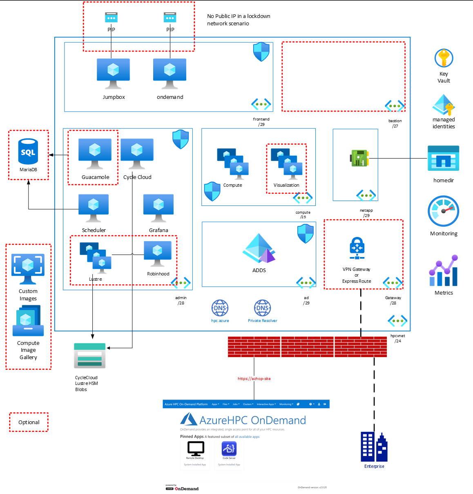

# Azure HPC OnDemand Platform
Azure HPC OnDemand Platform or **azhop**, delivers an end-2-end deployment mechanism for a complete HPC cluster solution in Azure. Industry standard tools like [Terraform](https://www.terraform.io/), [Ansible](https://www.ansible.com/) and [Packer](https://www.packer.io/) are used to provision and configure this environment containing :

- An [OpenOn Demand Portal](https://osc.github.io/ood-documentation/master/) for a unified user access, remote shell access, remote visualization access, job submission, file access and more,
- An Active Directory for user authentication and domain control,
- An Open PBS or SLURM Job Scheduler,
- [Azure Cycle Cloud](https://docs.microsoft.com/en-us/azure/cyclecloud/?view=cyclecloud-8) to handle autoscaling of nodes thru job scheduler integration,
- A Jumpbox to provide admin access,
- Azure Netapp Files for home directory and data storage,
- A Lustre cluster for the scratch storage with HSM capbilities to Azure Blobs thru a [RobinHood](https://github.com/cea-hpc/robinhood) integration,
- [Grafana](https://grafana.com/) dashboards to monitor your cluster

This documentation encompasses 

 * The [Deployment Guide](deploy/index.md) for configuring and deploying your AZHOP environmment.
 * The [User Guide](user_guide/index.md) explaining how to submit jobs, manage files & more
 * [Tutorials](deploy/index.md) for specific use cases
 * The [Administrator Guide](operate/index.md) for cluster admins
