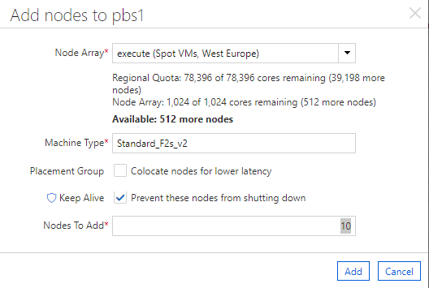

# Manually adding nodes
Since version [1.0.9](https://github.com/Azure/az-hop/releases/tag/v1.0.9) users defined with the admin role in `az-hop` are now admins for clusters in Cycle Cloud. This means that nodes can be added or removed from the Cycle Cloud monitoring page.

Note: This feature is restricted to the OpenPBS scheduler.

To add nodes :
- Browse to the Cycle Cloud portal,
- In the `Actions` menu of the `Nodes` tab select `Add`,

- Select the `Node Array` type
- Check `Colocate nodes` if you need to run MPI or latency sensitive applications in between these nodes
  - In this case create a new placement group
- Check `Keep Alive` to manually start and stop the nodes, autoscaling will be disabled for these instances
- Set how many nodes to add
- Click `Add`

> Note: When using PBS, and if `Colocate nodes` is not checked then you should specify `ungrouped=true` in the resource constraints of the qsub command.

> qsub -l select=1:slot_type=htc:ungrouped=true -I

