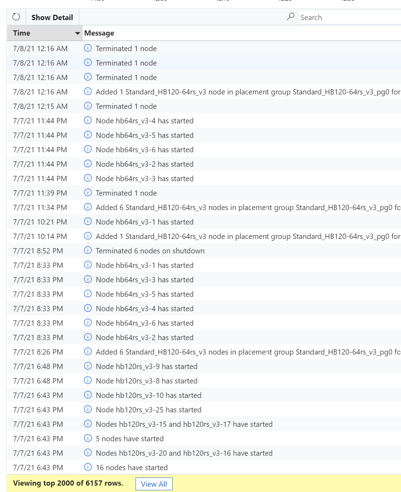

# Monitor Jobs
Monitoring jobs can be done from the OnDemand portal thru the `Jobs/Active Jobs` menu. From there, each active job can be expanded to get details on it's status.

## Job is not starting
If a job is not starting, check which **slot_type** have been used in the job resources, and then in the CycleCloud portal check the status of the node array for this slot type. Nodes can take some time to register in the job scheduler. Check for errors message and time when nodes have been started in the CycleCloud message pane.

There are several reasons why a job won't start, the most known being :
- the node renaming is failing (for whatever reason), hence it won't be registered in the scheduler. Workaround is to add a new node thru a fake job if possible, and the failed node will automatically being removed after 15mn.
- the `slot_type` is case sensitive, so make sure the slot_type in the job is correct,
- an init script is failing to run. Workaround is to add a new node thru a fake job if possible, and the failed node will automatically being removed after 15mn.
- there is not enough quota to run that job.