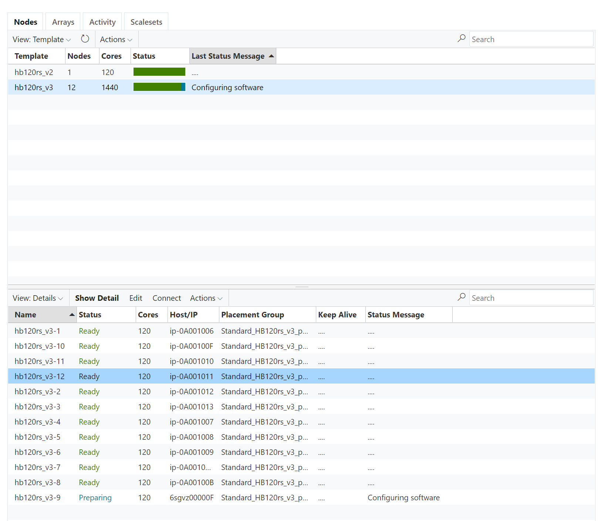

# Monitor Nodes
Node monitoring can be done thru the `Monitoring / Azure CycleCloud` menu which will open the Azure CycleCloud portal. From there you have a global view of all nodes being provisioned for the cluster, all organized in `node arrays` (aka `slot_type` for jobs), as defined in the `queues` section of the configuration file.

Nodes statuses are listed in the central pane. Nodes *ready* appears in green, *provisioning* in blue and *deleting* in red. Each node will have a status message with more details. 

> Note : There is an identified bug that shows 'Failed to create node' at the beginning of each node creation. This error can be avoided and the node creation process will continue

You can double click on one of the node to see more details.

## Automatic Health checks
Upon node starting a health check script is run which will validate the Infiniband device presence and status and for GPU nodes if the `nvidia-smi` command can be run. This health script can be customized and is present in the `playbooks/roles/cyclecloud_pbs/cluster-init/files/check_stuff.sh` file.

If a node reports a bad health, then Cycle will remove it from the set of allocated machines and a new one will be provisioned. An alert message will be logged in the message pane like below.

