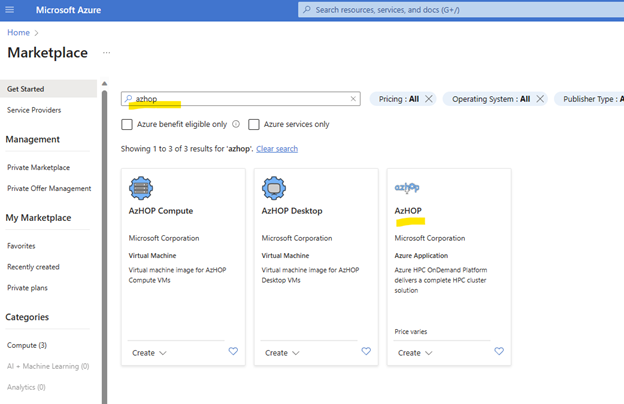
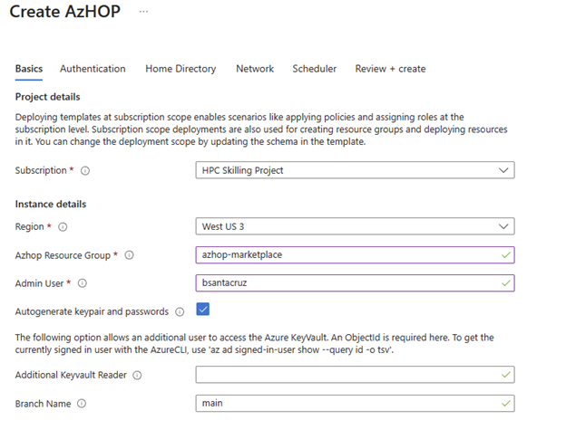
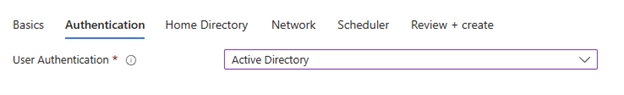

<!--ts-->
* [Quick Installation Guide](#quick-installation-guide)
   * [Requirements](#requirements)
   * [Before the hands-on lab](#before-the-hands-on-lab)
      * [Task 1: Validate the owner role assignment in the Azure subscription](#task-1-validate-the-owner-role-assignment-in-the-azure-subscription)
   * [Quick installation of the Azure HPC OnDemand Platform environment](#quick-installation-of-the-azure-hpc-ondemand-platform-environment)
      * [Task 1: Set up WSL2](#task-1-set-up-wsl2)
      * [Task 2: Validate a sufficient number of vCPU cores](#task-2-validate-a-sufficient-number-of-vcpu-cores)
      * [Task 3: Installing the toolchain in the Linux system](#task-3-installing-the-toolchain-in-the-linux-system)
      * [Task 4: Login in Azure](#task-4-login-in-azure)
      * [Task 5 : Prepare the configuration file to build the environment](#task-5-prepare-the-configuration-file-to-build-the-environment)
      * [Task 6: Deploy the resources and install apps](#task-6-deploy-the-resources-and-install-apps)
      * [Task 7: Access the Azure HPC On-Demand Platform dashboard](#task-7-access-the-azure-hpc-on-demand-platform-dashboard)
   * [Deprovision Azure HPC OnDemand Platform environment](#deprovision-azure-hpc-ondemand-platform-environment)
<!--te-->
<!-- https://github.com/ekalinin/github-markdown-toc -->
<!-- ./gh-md-toc --insert --no-backup --hide-footer -->

[Quick Start](https://grafana.com/)
# Marketplace deployment
AzHop is now available in the Azure Marketplace allowing you to deploy the solution utilizing the installation process that you are familiar with like any other package in the Azure Marketplace.
With this tutorial you will deploy the necessary architecture for AzHop to work in Azure.
This tutorial with create the following resources.

- An [Open OnDemand](https://osc.github.io/ood-documentation/latest/) Portal for a unified user access, remote shell access, remote visualization access, job submission, file access and more,
- An Active Directory for user authentication and domain control,
- An Open PBS or SLURM Job Scheduler,
- [Azure CycleCloud](https://learn.microsoft.com/en-us/azure/cyclecloud/?view=cyclecloud-8&WT.mc_id=Portal-Microsoft_Azure_Marketplace) to handle autoscaling of nodes thru job scheduler integration,
- A Jumpbox to provide admin access,
- Azure Netapp Files for home directory and data storage,
- A Lustre cluster for the scratch storage with HSM capabilities to Azure Blobs thru a [Robinhood](https://github.com/cea-hpc/robinhood) integration,
- [Grafana](https://grafana.com/) dashboards to monitor your cluster.

# Steps
Open your Microsoft Azure account and then go to the Azure Marketplace and **type** "Azhop" then **Enter**.
From the search results **select** AzHop and then click on **Create**.

 

## Basics
In the basics tab input the following parameters:
- **AzHop Resource Group** – Name of the resource where it is going to be deployed.
- **Admin User** – Username for the cluster admin.
- **Branch** - Specify the [AzHop Branch](https://github.com/Azure/az-hop/branches) you would like to deploy, "main" is the default one.

 

**Next**

## Authentication
For the authentication section we have two options available, "Active Directory" and "Local"
- **Active Directory** - AzHop manage users through Active Directory and create passwords in they KeyVault.
- **Local** - AzHop manage users locally for each application and create passwords in KeyVault.

The recommended configuration is to select Active Directory, this will allow you to manage users in multiple locations in one place.

 

**Next**

## Home Directory

https://github.com/Azure/az-hop/branches``