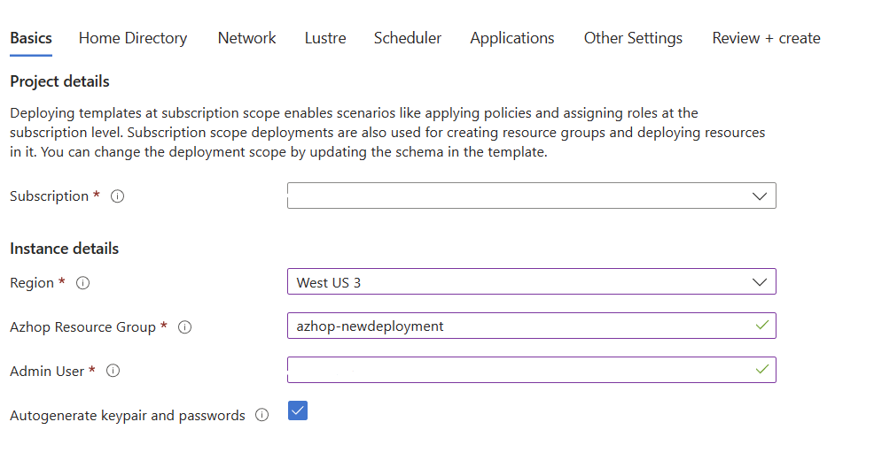
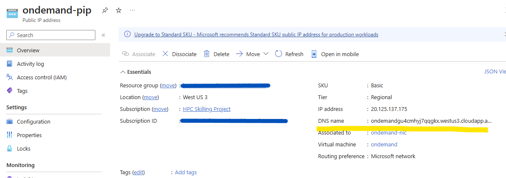

<!--ts-->
* [Marketplace deployment](#marketplace-deployment)
* [Deployment steps](#deployment-steps)
   * [Basics](#basics)
   * [Authentication](#authentication)
   * [Home Directory](#home-directory)
   * [Network](#network)
   * [Scheduler](#scheduler)
   * [Review](#review)
* [Access OnDemand](#access-ondemand)
   * [Retrieve credentials](#retrieve-credentials)
      * [Granting Permissions](#granting-permissions)
      * [Read password](#read-password)
   * [Retrieve URL](#retrieve-url)
   * [Testing](#testing)

<!--te-->
<!-- https://github.com/ekalinin/github-markdown-toc -->
<!-- ./gh-md-toc --insert --no-backup --hide-footer -->
# Marketplace deployment
AzHop is now available in the Azure Marketplace allowing you to deploy the solution utilizing the installation process that you are familiar with like any other package in the Azure Marketplace.
With this tutorial you will deploy the necessary architecture for AzHop to work in Azure.
This tutorial with create the following resources.

- An [Open OnDemand](https://osc.github.io/ood-documentation/latest/) Portal for a unified user access, remote shell access, remote visualization access, job submission, file access and more,
- An Active Directory for user authentication and domain control,
- An Open PBS or SLURM Job Scheduler,
- [Azure CycleCloud](https://learn.microsoft.com/en-us/azure/cyclecloud/?view=cyclecloud-8&WT.mc_id=Portal-Microsoft_Azure_Marketplace) to handle autoscaling of nodes thru job scheduler integration,
- A Jumpbox to provide admin access,
- Azure Netapp Files for home directory and data storage,
- A Lustre cluster for the scratch storage with HSM capabilities to Azure Blobs thru a [Robinhood](https://github.com/cea-hpc/robinhood) integration,
- [Grafana](https://grafana.com/) dashboards to monitor your cluster.

# Deployment steps
Open your Microsoft Azure account and then go to the Azure Marketplace and **type** "Azhop" then **Enter**.
From the search results **select** AzHop and then click on **Create**.

 

## Basics
In the basics tab input the following parameters:
- **AzHop Resource Group** – Name of the resource where it is going to be deployed.
- **Admin User** – Username for the cluster admin.
- **Branch** - Specify the [AzHop Branch](https://github.com/Azure/az-hop/branches) you would like to deploy, "main" is the default one.

 

**Next**

## Authentication
For the authentication section we have two options available, "Active Directory" and "Local"
- **Active Directory** - AzHop manage users through Active Directory and create passwords in they KeyVault.
- **Local** - AzHop manage users locally for each application and create passwords in KeyVault.

The recommended configuration is to select Active Directory, this will allow you to manage users in multiple locations in one place.

 

**Next**

## Home Directory
The Home Directory is where the files from the High Performance Computing projects will live.
AzHop has the capability of using the power of [Azure Files](https://learn.microsoft.com/en-us/azure/storage/files/storage-files-introduction) and [Azure NetApp Files](https://learn.microsoft.com/en-us/azure/azure-netapp-files/azure-netapp-files-introduction) for your projects.
- **Storage Type** - Review the [Azure Files and Azure NetApp Files comparison](https://learn.microsoft.com/en-us/azure/storage/files/storage-files-netapp-comparison).
For this tutorial the recommendation is to use Azure Files.
- **Mount point** - Is where the drive will be mounted. Default value is "/clusterhome".
- **Capacity** - Size of the drive that will be mounted. Defauilt value is "1024GB".

 

**Next**

## Network
AzHop have the option to allow access through public IP as well as to customize the CIDR Prefix to use and the Base IP address.
- **Enable Public IP address** - Default value is "checked"
- **CIDR Prefix** - This will determine the amount of nodes available. Default value is "/24"
- **Base IP Address** - Address space to use in the VNET hosting AzHop. Default value is "10.0.0.0".

 

**Next**

## Scheduler
The scheduler will dictate how the workload is going to operate. 
AzHop offers [Open PBS](https://learn.microsoft.com/en-us/azure/cyclecloud/openpbs?view=cyclecloud-8) and [SLURM](https://learn.microsoft.com/en-us/azure/cyclecloud/slurm?view=cyclecloud-8) with SLURM Accounting as optional.

- **Scheduler** - Default value is "SLURM"
- **SLURM accounting** - Default value is "Checked"

 

**Next**

## Review
Validate that the sumnmary configuration is looking as expected and select "Create" to initiate the installation process.

# Access OnDemand
## Retrieve credentials
During the deployment process, AzHop created a secure password to access the OnDemand VM which will serve as your HPC Hub.

### Granting Permissions
1.- Go to the resource group created and open the KeyVault.
2.- Once in the KeyVault select "Access Policies" from the sidebar and then Create.

 

3.- From the dropdown-list select "Key, Secret & Certificate Management" to create a policy with those permissions and click "Next"
4.- Under the Principal Tab search for the account you are using to access the Azure environment. Once that you find it, select it and click "Next".
5.- Skip the "Application" tab by clicking "Next".
6.- Review the policy details and click "Create".

 

This process will create a KeyVault policy and grant you access to read the "Secrets" which is where the credentials got save during the installation.

### Read password
In the same KeyVault go to Secrets and then look for the item "clusteradmin-password" which contain the password for the account "clusteradmin" and select it.

1.- Select the item under "CURRENT VERSION".

 

2.- That will open the secret details, now select "Show Secret Value" to visualize the secure password and click on the copy icon to "Copy" the password.

 

3.- Select "Close" to exit this view securely.

## Retrieve URL
As instructed during the configuration process, AzHop create a Public IP to access the OnDemand platform.

1.- Go back to the resource group for AzHop and find the "ondemand-pip" Public IP address item.
2.- The URL will be under the essentials section next to the "DNS Name".

 

## Testing
With this steps you should have:

- **Username** - "clusteradmin" for OnDemand
- **Password** - Retrieved from the KeyVault.
- **OnDemand URL** - Retrieved from the PIP.

Which is all you need to access the OnDemand platform.
Go to your WebBrowser and insert the OnDemand URL and enter the credentials to access.
>Note: It may take a few minutes to finish the installation process, after that the system should work as expected.

 

Voila! AzureHPC OnDemand should be ready to use.

 