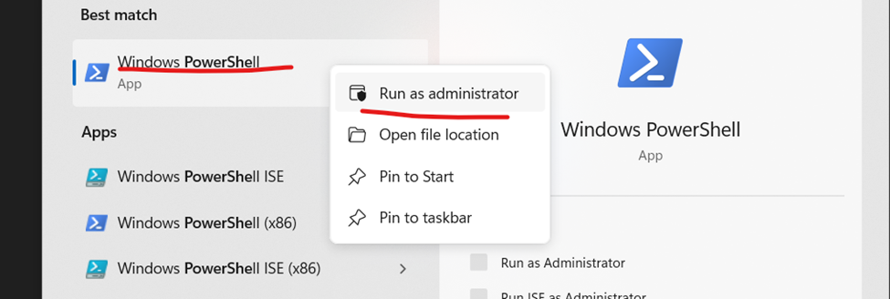
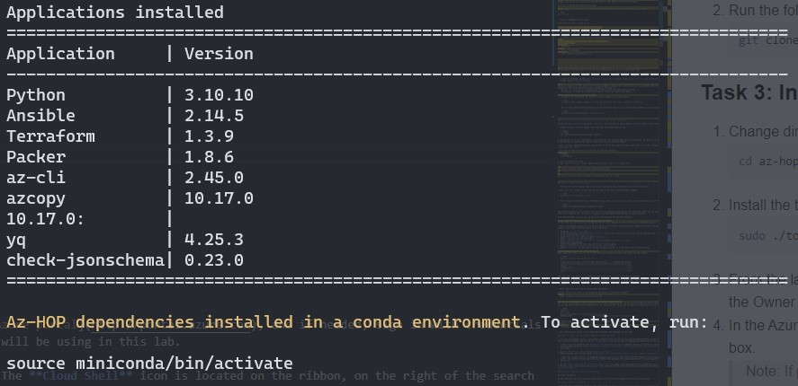

<!--ts-->
* [Quick Installation Guide](#quick-installation-guide)
   * [Requirements](#requirements)
   * [Before the hands-on lab](#before-the-hands-on-lab)
      * [Task 1: Validate the owner role assignment in the Azure subscription](#task-1-validate-the-owner-role-assignment-in-the-azure-subscription)
   * [Quick installation of the Azure HPC OnDemand Platform environment](#quick-installation-of-the-azure-hpc-ondemand-platform-environment)
      * [Task 1: Set up WSL2](#task-1-set-up-wsl2)
      * [Task 2: Validate a sufficient number of vCPU cores](#task-2-validate-a-sufficient-number-of-vcpu-cores)
      * [Task 3: Installing the toolchain in the Linux system](#task-3-installing-the-toolchain-in-the-linux-system)
      * [Task 4: Login in Azure](#task-4-login-in-azure)
      * [Task 5 : Prepare the configuration file to build the environment](#task-5-prepare-the-configuration-file-to-build-the-environment)
      * [Task 6: Deploy the resources and install apps](#task-6-deploy-the-resources-and-install-apps)
      * [Task 7: Access the Azure HPC On-Demand Platform dashboard](#task-7-access-the-azure-hpc-on-demand-platform-dashboard)
   * [Deprovision Azure HPC OnDemand Platform environment](#deprovision-azure-hpc-ondemand-platform-environment)
<!--te-->
<!-- https://github.com/ekalinin/github-markdown-toc -->
<!-- ./gh-md-toc --insert --no-backup --hide-footer -->

# Quick Installation Guide
This quick installation guide will take you to the steps to build and use an OnDemand HPC cluster on Azure through the deployment of a simple **Azure HPC On-Demand Platform** environment.
In this light environment, there is NO Lustre cluster, NO Window Viz nodes.
**Az-hop** CentOS 7.9 Azure marketplace images for compute and remote desktop nodes will be used.

To provision the **Az-hop** environment a Windows Subsystem for Linux (**WSL**) is needed to run the scripts and configure all components needed using Ansible playbooks. This second step is longer as it needs to install and configure Domain Control, CycleCloud, OpenOndemand, PBS, Grafana and many other things. The use of Ansible will allow this system to be updated and in case of failure the installation to be repaired.

>Note: If you are looking to deploy the full version of AzHop with Lustre and more customization options, I recommend you to use the [Quick Start](https://azure.github.io/az-hop/tutorials/quickstart.html) guide.

## Requirements

- Microsoft Azure subscription
- Work or school account with the Owner role in the Azure subscription
- Lab computer with:

  - Access to Azure
  - A web browser supported by the Azure portal (Microsoft Edge, Google Chrome, or Mozilla Firefox)

## Before the hands-on lab

Duration: 15 minutes

To complete this lab, you must verify that your account has sufficient permissions to the Azure subscription that you intend to use to deploy all required Azure resources. The Azure subscription must have a enough available vCPUs.

### Task 1: Validate the owner role assignment in the Azure subscription

1. From the lab computer, start a web browser, navigate to [the Azure portal](http://portal.azure.com), and if needed, sign in with the credentials of the user account with the Owner role in the Azure subscription you will be using in this lab.
1. In the Azure portal, use the **Search resources, services, and docs** text box to search for **Subscriptions**, and in the list of results, select **Subscriptions**.
1. On the **Subscriptions** list, select the name of the subscription you intend to use for this lab.
1. On the subscription blade, select **Access control (IAM)**.
1. Click on the **Check access** button and then type the email you used to login. Click on your name and validate that your user account has the `Owner` role assigned to it.

## Quick installation of the Azure HPC OnDemand Platform environment

Duration: 50 minutes

In this exercise, you will learn how to deploy **Az-hop** utilizing a Linux machine.

### Task 1: Set up WSL2
#
To install **Az-hop** we require to have a Linux machine that could support the toolchain to use during the installation, it is preferred to use Ubuntu 20.04+. So, if you are running a Windows desktop you should use WSL2 with an Ubuntu 20.04 environment.

Run the following commands to install WSL2 (you will only need to do this once on your local device) in your Windows computer.

1.	Open PowerShell as administrator.

 

2.	Execute the following command to install WSL2:

```bash
wsl --install
```

3.	After installation is complete, restart your computer.

4.	Once your computer turns back on, run WSL (search for it in your computer's Start menu if it doesn't open automatically). The prompt is going to ask you to set up a username and password for your Ubuntu Linux Virtual machine.


 
5.	Now, open your Linux shell (i.e. Command Prompt). Validate that you are running version 2 of WSL.

```bash
wsl --status
```


6. Update Azure CLI using
    ```bash
    az upgrade
    ```
After this the WSL2 is ready to use.

### Task 2 : Cloning the Az-hop GitHub repository
1. Open WSL in your Windows machine to start WSL.

2. Run the following command to clone the latest version of **Az-hop** from the public GiHub repository.

   ```bash
   git clone --recursive https://github.com/Azure/az-hop.git
   ```
### Task 3: Installing the toolchain in the Linux system
1. Change directory
    ```bash
    cd az-hop
    ```
2. Install the toolchain
    ```bash
    sudo ./toolset/scripts/install.sh
    ```
    After the installation is done, a list of the applications installed will appear as shown below.
    

### Task 4: Login in Azure
1. Run the following command to start the sign in process in browser, log in with the Azure account you are using for the deployment. 
    Replace `<tenant_ID>` for the tenant ID where the subscription is located.
    ```bash
    az login --tenant '<tenant_ID>' --use-device-code
    ```
2. After the login process finished, change to the subscription you will use for the deployment. First locate the Subscription ID in this tenant by running the following command
    ```bash
    az account list -otable --query '[].{subscriptionId: id, name: name, isDefault: isDefault}'
    ```
3. Proceed to select the subscription in scope by replacing `<subscription_ID>` with the Subscription ID obtained in the last step in the following command.

    ```bash
    az account set --subscription '<subscription_ID>'
    ```

### Task 5: Prepare the configuration file to build the environment

During this task, you will prepare the **config.yml** file to configure the environment.

1. Get into the az-hop folder downloaded previously on Task #2 and execute the following command to create a new copy of the config file with the right extension.
    >Note: During this exercise you will use a lighter version of the original config file designed for the Quick Install guide.

   ```bash
   cp examples/qinstall-config config.yml
   ```

2. Review the **config.yml** file content, which describe the resources that will be provisioned. Use the following command to open the file in editor mode. You can leave the default configuration and just change the **project_name, location and resource_group** values.

    ```bash
    vim config.yml
    ```
    

### Task 6: Deploy the resources and install apps

1. Run the Bicep plan script to validate changes to be executed.
    ```bash
   ./build.sh -a plan -l bicep
    ```
    If no errors have been detected you can proceed to execute the following code to start the deployment utilizing Bicep.
    ```bash
   ./build.sh -a apply -l bicep
    ```
2. After the deployment of resources is done, we proceed to create the passwords needed to connect the accounts.
    ```bash
   ./create_passwords.sh
    ```
3. Finally we execute the command to install the software needed to run **Az-Hop**
    ```bash
    ./install.sh
    ```
    
    This process takes around 40 minutes.

4. Gather the password created for the admin account to access the OnDemand platform.
    ```bash
    ./bin/get_secret clusteradmin
    ```
5. Obtain the URL to access **Az-Hop** OnDemand platform.
    ```bash
    grep ondemand_fqdn playbooks/group_vars/all.yml
    ```

    

### Task 7: Access the Azure HPC On-Demand Platform dashboard

1. From the lab computer, start a web browser, navigate to the URL of the Azure HPC On-Demand Platform portal you identified earlier in the last task, and when prompted sign in with the **clusteradmin** user account and its password you identified in the previous step.

   > Note: You'll be presented with the **Azure HPC On-Demand Platform** dashboard. Review its interface, starting with the top-level menu, which provides access to **Apps**, **Files**, **Jobs**, **Clusters**, **Interactive Apps**, **Monitoring**, and **My Interactive Sessions** menu items.

1. In the **Monitoring** menu, select **Azure CycleCloud**.
1. When presented with the page titled **App has not been initialized or does not exist**, select **Initialize App**.

   > Note: This prompt reflects the OnDemand component architecture, which the Azure HPC OnDemand Platform solution relies on to implement its portal. The shared frontend creates Per User NGINX (PUN) processes to provide connectivity to such components as **Azure CycleCloud** and **Grafana**.

1. On the **Azure CycleCloud for Azure HPC On-Demand Platform** page, note the presence of a configuration of a cluster named **pbs1**.
1. On the **pbs1** page, select the **Arrays** tab, and note that it contains entries representing queue definitions defined in the **/az-hop/config.yml** file.

## Deprovision Azure HPC OnDemand Platform environment

Duration: 5 minutes

In this exercise, you will deprovision the Azure HPC OnDemand Platform lab environment.

### Deprovision the Azure resources

1. On the lab computer, switch to the browser window displaying the Azure portal
2. Delete the resource group you have chosen to deploy **Az-hop** in.