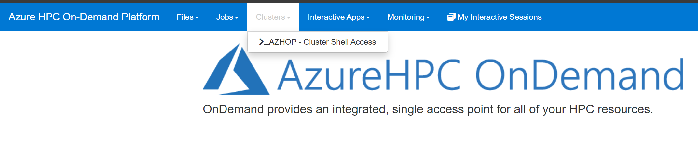
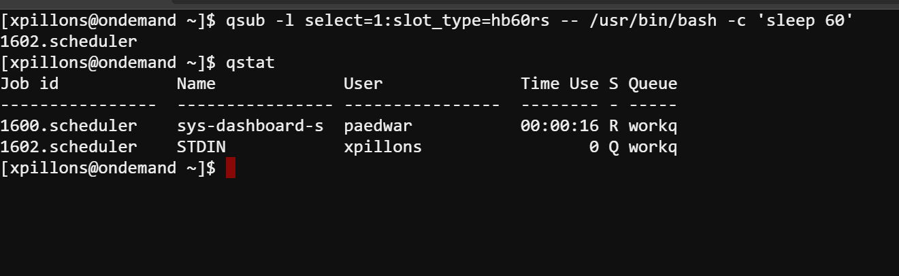

# Clusters access

From the portal, select the menu **Clusters/_AZHOP - Cluster Shell Access** to open a shell window.


Then submit a simple test job

```bash
qsub -l select=1:slot_type=hb60rs -- /usr/bin/bash -c 'sleep 60'
qstat
```


