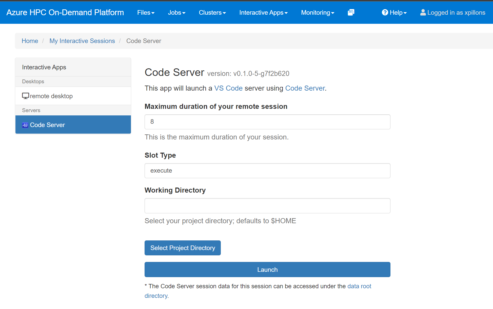

# Code Server
Code Server is Visual Studio Code running in a browser. You can request to start a session, which will queue a job and provision a VM for your session thru the `Interactive Apps / Code Server` menu.

Set the `Maximum duration` for your session, `slot_type` and `Working Directory` then click on the `Launch` button.

If no machine are available, your request will be queued and a new VM will be provisioned.

Once ready the session can be launched by clicking on the `Connect to VS Code` button.

This will open a new tab in your browser with `Visual Studio Code` open in your home directory. Your session will always be running even if you close the tab, as long as the request is not terminated. You can retrieve your running session thru the `My Interactive Sessions` menu.

