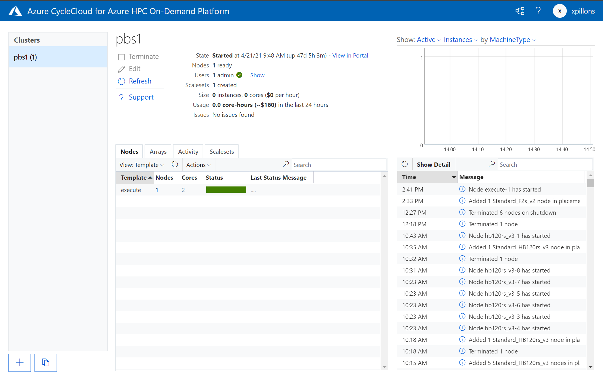

# Cycle Cloud

Access to the `Azure Cycle Cloud` UI can be done thru the `Monitoring / Cycle Cloud` menu. This will open the `Cycle Cloud`portal in a Read Only mode for end users, so they have a view of the status of the nodes in the cluster.

The complete documentation of `Azure Cycle Cloud` can be find [here](https://docs.microsoft.com/en-us/azure/cyclecloud/?view=cyclecloud-8).