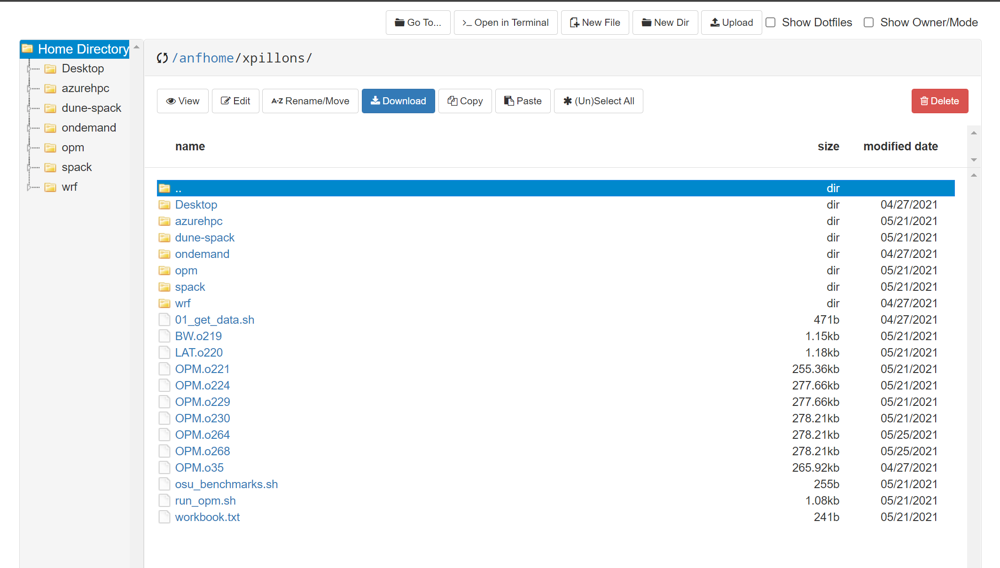

# Files
You can access files from your home directory directly from the OnDemand interface. To do so open the `File/Home Directory` menu.

This will open a file explorer from which you can `browse`, `view`, `edit`, `upload`, `download` and more actions on files and directories.

