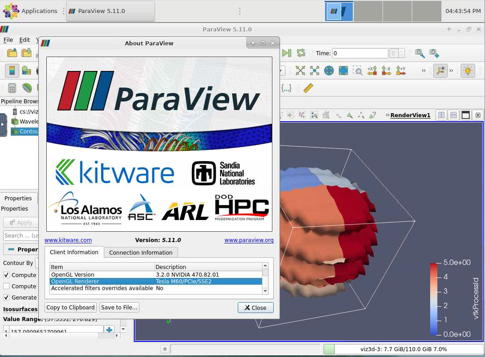

# ParaView

[ParaView](https://www.paraview.org/) is an open source, multi-platform data analysis and visualization application. In
AzHOP deployments with the ParaView application enabled, users can start a ParaView session to analyze their data interactively.

## Prerequisites

ParaView is not enabled by default. To enable it, please contact your AzHOP administrator.
When enabled, ParaView will be available in the `Interactive Apps / ParaView` menu.

## Starting a ParaView session

The following image shows the launch form for a ParaView session. Once you have selected the desired parameters,
click on the `Launch` button.

Once the session has started, you can connect to it by clicking on the `Launch ParaView` button.

This will open a new tab in your browser with ParaView open. Your session will always be running even if you close the tab.
Closing the ParaView window, however, will terminate the session.

If the session was launched on nodes that have GPUs, the ParaView will use the GPUs to accelerate the rendering. Otherwise,
the rendering will be done on the CPU using Mesa3D.

Based on number of cores allocated to the job, the ParaView session will be launched to use parallel `pvserver` running
on the same node to better utilize the available resources. Jobs spanning multiple nodes are not supported currently.
