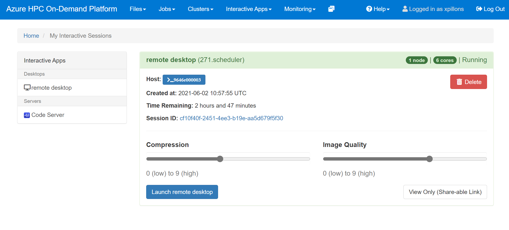
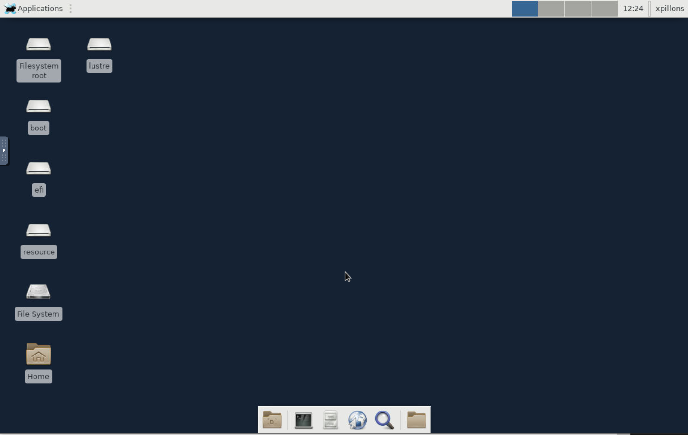

# Remote Desktop

A Linux remote desktop session can be requested for a limited amount of time thru the `Interactive Apps / Remote Desktop` menu. This will open the request form.


After entering the number of hours, click on the `Launch` button. This will queue your request and open the list of your interactive sessions and there status if any.


If no machines are available to serve your request, and if there are enough quota, a new machine will be provisionned. You can use the `Monitoring / Cycle Cloud` menu to access the Cycle Cloud portal and check the provisioning status.

Once a node is available to be used, your queued remote session request will be updated like in the screenshot below. Choose which level of `Compression=` and `Image Quality` you want and then click on the `Launch Remote Desktop` button. Note that the time remaining is displayed so you know how long you can work on this session. Be aware that you can't expand that time and a new session will have to be created. This is also from here that you can delete your session once done to release the resources.



A new browser tab will be created with a noVNC session in it.



From there your home dir is mounted and you can start using your visualization software.

> 
> **Note**: To use GPU offloading, run your application with the `vglrun` command.

> On a multi GPU instance you can specify on which GPU you want to run by setting the VGL_DISPLAY environment variable before calling vglrun.
```bash
export VGL_DISPLAY=:0.<gpu_id>
```