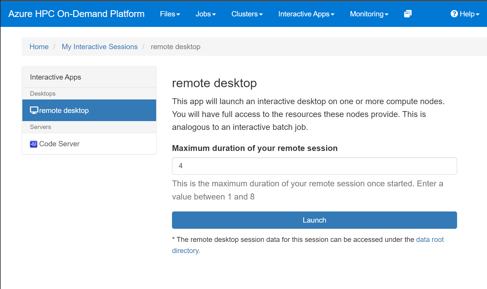
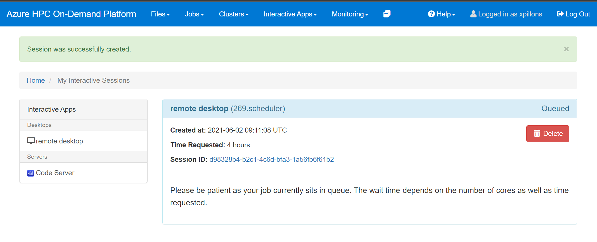

# Remote Desktop

A Linux remote desktop session can be requested for a limited amount of time thru the `Interactive Apps / Remote Desktop` menu. This will open the request form.

After entering the number of hours, click on the `Launch` button. This will queue your request and open the list of your interactive sessions and there status if any.

If no machines are available to serve your request, and if there are enough quota, a new machine will be provisionned. You can use the `Monitoring / Cycle Cloud` menu to access the Cycle Cloud portal and check the provisioning status.

