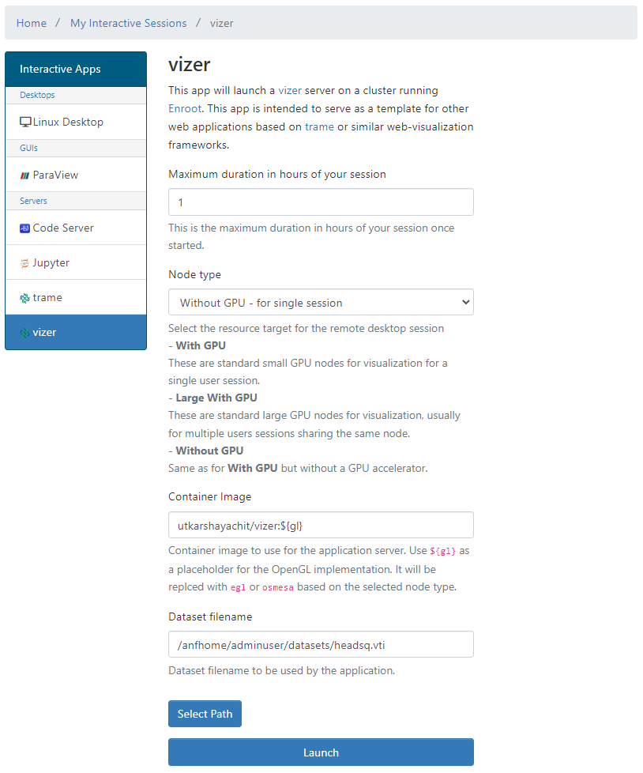
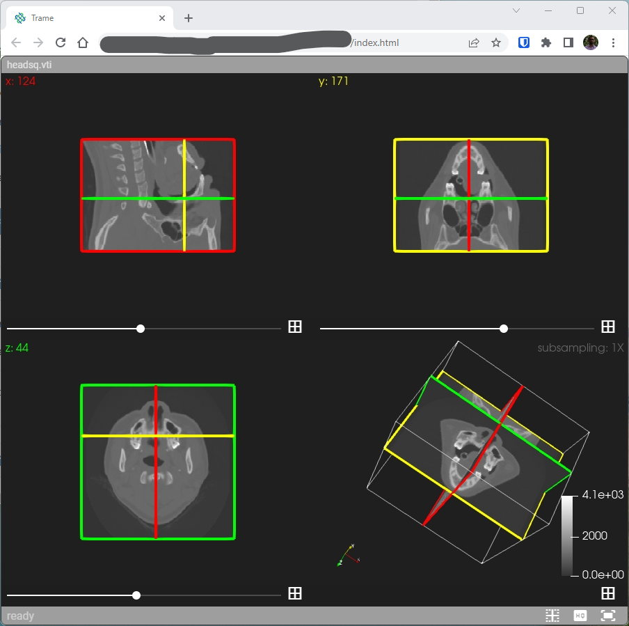

# vizer: a [trame] based web visualization application

[vizer] is simple proof-of-concept web application for visualizing data using predefined pipelines. The application
uses [trame] together with [ParaView] 

## Prerequisites

**vizer** is not enabled by default. To enable it, please contact your AzHOP administrator.
When enabled, **vizer** will be available in the `Interactive Apps / vizer` menu.

## Starting a **vizer** session

The following image shows the launch form for a **vizer** session. Once you have selected the desired parameters,
click on the `Launch` button.

**vizer** application is designed to load a dataset on startup. The dataset is specified using the `Dataset filename` field. You can use the **Select Path** button to interactively select the dataset.
The dataset file must be placed on the shared filesystem. The directory containing the dataset file will
be mounted in the vizer container with read-only permissions.
The dataset file must be in one of the formats supported by ParaView. Based on the type of dataset, the application
will load the appropriate pipeline. For example, for 3D volumetric datasets,
the applications shows a quad view showing 2D slices, as shown in the following image.

The default installation of **vizer** comes with a sample datasets downloaded from [paraview.org](https://www.paraview.org/files/data/ParaViewTutorialData-20220629.tar.gz)
and placed under `/anfhome/apps/vizer/datasets`. You can use these datasets to test the application.

If the session was launched on nodes that have GPUs, vizer will use the GPUs to accelerate the rendering. Otherwise,
the rendering will be done on the CPU using Mesa3D. For that to work, correct container images must be specified in the launch
parameters.

[trame]: https://kitware.github.io/trame/index.html
[vizer]: https://github.com/utkarshayachit/vizer
[ParaView]: https://www.paraview.org/
