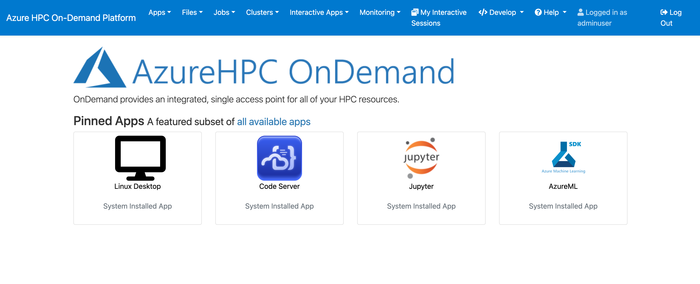
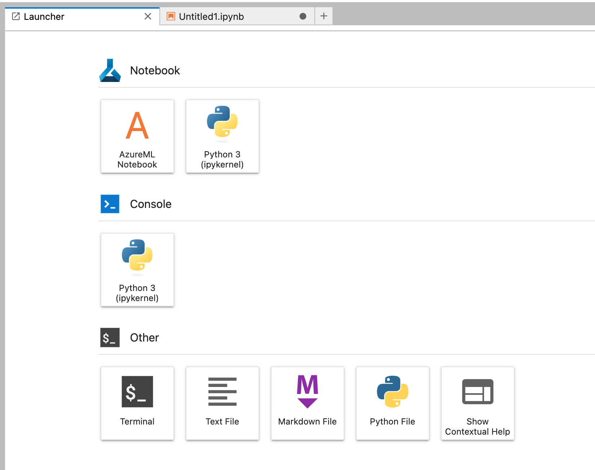
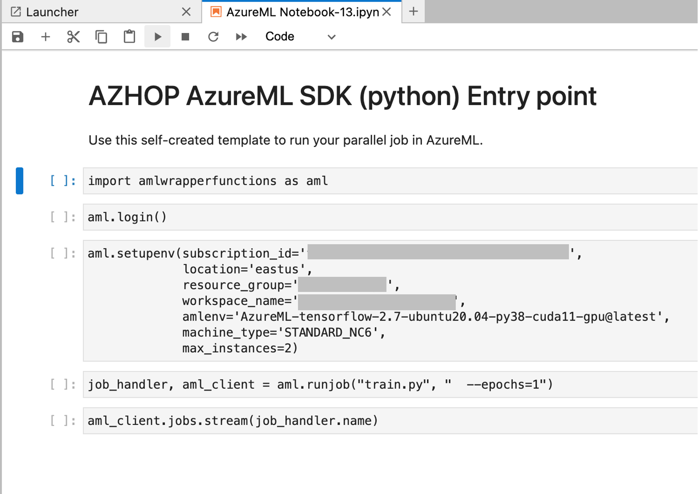

# AzureML + AZHOP Integration

## Overview

The goal of this application is to allow a person to submit (parallel) jobs to AzureML (Azure Machine Learning) from the azhop portal. This may be interesting in scenarios where azhop user needs to run both traditional HPC applications and ML/DL applications. By using this application users can interact with a single portal to mange their workloads.

## Implementation

This implementation is based on the existing azhop Jupyter application: [BC_JUPYTER](https://github.com/Azure/az-hop/tree/main/playbooks/roles/ood-applications/files/bc_jupyter)

With some extra steps:
- When the jupyter cluster container is provisioned, azhop installs all required
  packages to handle AzureML plust a jupyter extension to add shortcuts in the
  jupyterlab launcher [extension](https://jupyter-app-launcher.readthedocs.io/en/latest/);
- The container also contains a series of AzureML wrapper functions to simplify
  the use of AzureML SDK;
- A notebook is auto-generated contained a small group of cells to perform basic
  tasks, including Azure login, environment setup (e.g. resource group creation,
  workspace creation, cluster creation, etc...), job submission, and job
  execution tracking;
- All this information to create the notebook comes from the added UI fields
  that the user will fill when provisioning the jupyter container;
- This notebook is placed in the JupyterLab launcher dashboard, so the user can
  easily located it.

## Usage

When creating an azhop environment, the ``bc_amlsdk`` application needs to be
enabled in the azhop ``config.yml``. Please follow the main azhop instruction on
this.

When the azhop environment is provisioned, there are three major steps to be
followed:
- Upload the training python code in the ``src`` directory by clicking in the
  top menu "File->Home Directory". Please create the ``src`` folder there and upload your file;
- Click on the Interactive Apps->AzureML menu;
- Fill the fields in the UI and click launch to create the container in the
  azhop cluster;
- Once the provision is concluded, just click on "Connect to Jupyter" button and
  click on AzureML notebook displayed in the Jupyter Launcher
- After that just follow the instructions in the notebook

  

  

  

